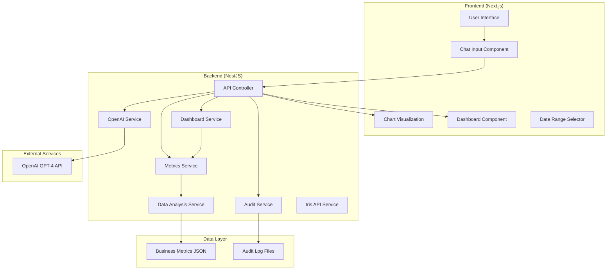

# 🎯 Iris Finance - Chat to Chart AI Platform

**Transform natural language into intelligent business charts using AI and automated data discovery.**

An enterprise-grade Business Intelligence platform that converts conversational queries into dynamic, interactive visualizations powered by OpenAI GPT-4, featuring comprehensive audit trails and multi-chart dashboard generation.

---

## 📋 Table of Contents

- [🌟 Overview](#-overview)
- [✨ Key Features](#-key-features)
- [🏗️ Architecture](#️-architecture)
- [🛠️ Tech Stack](#️-tech-stack)
- [📁 Project Structure](#-project-structure)
- [🚀 Quick Start](#-quick-start)
- [⚙️ Configuration](#️-configuration)
- [📡 API Documentation](#-api-documentation)
- [🎨 Frontend Components](#-frontend-components)
- [🔍 Data Analysis Engine](#-data-analysis-engine)
- [📊 Dashboard System](#-dashboard-system)
- [🔒 Audit & Compliance](#-audit--compliance)
- [💬 Usage Examples](#-usage-examples)
- [🧪 Testing](#-testing)
- [🚀 Deployment](#-deployment)
- [🔧 Development Guidelines](#-development-guidelines)
- [📈 Performance Considerations](#-performance-considerations)
- [🛡️ Security](#️-security)
- [🐛 Troubleshooting](#-troubleshooting)
- [📚 Additional Resources](#-additional-resources)

---

## 🌟 Overview

Iris Finance Chat to Chart AI is a sophisticated business intelligence platform that democratizes data visualization through natural language processing. Users can ask questions in plain English and receive intelligent, contextually appropriate charts powered by GPT-4's understanding of business data.

### 🎯 Core Capabilities

- **Natural Language Processing**: Convert conversational queries into precise chart specifications
- **Intelligent Data Discovery**: Automatically identify and analyze 99+ metrics from complex business data
- **Dynamic Chart Generation**: Support for 5 chart types with smart type selection
- **Multi-Chart Dashboards**: Generate comprehensive dashboards with related visualizations
- **Enterprise Audit Trail**: Complete compliance logging for all chart generations
- **Interactive Data Tables**: View and manipulate chart data with sorting, filtering, and pagination

---

## ✨ Key Features

### 🧠 AI-Powered Intelligence
- **GPT-4 Integration**: Advanced natural language understanding for business queries
- **Context-Aware Analysis**: AI receives complete data structure analysis for optimal recommendations
- **Smart Chart Selection**: Automatically chooses the best visualization type based on data characteristics
- **Intelligent Grouping**: Automatic data grouping and aggregation based on query intent

### 📊 Visualization Excellence
- **5 Chart Types**: Line, bar, stacked-bar, heatmap, and waterfall charts
- **Interactive Tables**: ag-grid-powered data tables with enterprise features
- **Real-time Updates**: Dynamic chart updates based on user interactions
- **Responsive Design**: Optimized for desktop and mobile experiences

### 🏢 Enterprise Features
- **Complete Audit Trail**: Every chart generation logged with full context
- **Data Privacy**: Audit logs excluded from version control
- **Performance Monitoring**: Response time tracking and optimization
- **Scalable Architecture**: Built for enterprise-scale data processing

### 🔄 Data Processing
- **Multiple Data Types**: Scalar, time series, grouped series, and dynamic objects
- **Flexible Date Ranges**: Support for custom and preset date filtering
- **Nested Metrics**: Handle complex, embedded business data structures
- **Real-time Analysis**: Dynamic metric discovery and processing

---

## 🏗️ Architecture



---

## 🛠️ Tech Stack

### Backend Technologies
| Technology | Version | Purpose |
|------------|---------|---------|
| **NestJS** | ^10.0.0 | Node.js framework with dependency injection |
| **TypeScript** | ^5.0.0 | Type-safe development |
| **OpenAI** | ^4.0.0 | GPT-4 API integration |
| **Axios** | ^1.6.0 | HTTP client for external APIs |
| **class-validator** | ^0.14.0 | DTO validation and sanitization |
| **dotenv** | ^17.2.0 | Environment variable management |

### Frontend Technologies
| Technology | Version | Purpose |
|------------|---------|---------|
| **Next.js** | ^13.5.0 | React framework with SSR |
| **React** | ^18.0.0 | Component-based UI library |
| **ag-charts-react** | ^9.0.0 | Enterprise chart rendering |
| **ag-grid-react** | ^34.0.2 | Advanced data grid component |
| **ag-grid-community** | ^34.0.2 | Grid functionality (sorting, filtering, pagination) |
| **TypeScript** | ^5.0.0 | Type-safe frontend development |

### Development Tools
- **ts-node** - Direct TypeScript execution
- **nodemon** - Development server auto-restart
- **ESLint** - Code quality and style enforcement

---

## 📁 Project Structure

```
iris_chat_to_chart/
├── 📂 server/                          # NestJS Backend Application
│   ├── 📂 src/                         # Source code directory
│   │   ├── 📄 main.ts                  # Application entry point & module configuration
│   │   ├── 📄 app.controller.ts        # Main API endpoints (/chat, /dashboard, /feedback)
│   │   ├── 📄 chat.dto.ts              # Data Transfer Objects & validation schemas
│   │   ├── 📄 openai.service.ts        # GPT-4 integration & prompt engineering
│   │   ├── 📄 metrics.service.ts       # Data processing, slicing & transformation
│   │   ├── 📄 data-analysis.service.ts # Metric discovery & chart recommendations
│   │   ├── 📄 dashboard.service.ts     # Multi-chart dashboard generation
│   │   ├── 📄 audit.service.ts         # Compliance logging & audit trails
│   │   └── 📄 iris-api.service.ts      # External API integration service
│   ├── 📂 audit-logs/                  # Generated audit files (compliance)
│   │   ├── 📄 chart-*.json             # Individual request audit logs
│   │   └── ...                         # Timestamped audit files
│   ├── 📄 package.json                 # Backend dependencies & scripts
│   ├── 📄 tsconfig.json                # TypeScript configuration
│   └── 📄 test-data-analysis-service.ts # Service testing utilities
│
├── 📂 web/                             # Next.js Frontend Application  
│   ├── 📂 components/                  # React components directory
│   │   ├── 📄 ChatBox.tsx              # User input & API communication
│   │   ├── 📄 ChartView.tsx            # Single chart rendering & interaction
│   │   ├── 📄 DashboardView.tsx        # Multi-chart dashboard display
│   │   ├── 📄 DateRangeSelector.tsx    # Date filtering component
│   │   └── 📄 FeedbackWidget.tsx       # User feedback collection
│   ├── 📂 pages/                       # Next.js page routing
│   │   └── 📄 index.tsx                # Main application page
│   ├── 📄 package.json                 # Frontend dependencies & scripts
│   ├── 📄 tsconfig.json                # TypeScript configuration
│   ├── 📄 next.config.mjs              # Next.js configuration
│   └── 📄 next-env.d.ts                # Next.js type definitions
│
├── 📄 README.md                        # Comprehensive project documentation
└── 📄 AUDIT_README.md                  # Audit system documentation
```

### 🔍 Key File Descriptions

#### Backend Core Files
- **`main.ts`**: Application bootstrap, CORS configuration, and service registration
- **`app.controller.ts`**: REST API endpoints with validation and error handling
- **`openai.service.ts`**: GPT-4 prompt engineering and response parsing
- **`metrics.service.ts`**: Data transformation and chart data preparation
- **`data-analysis.service.ts`**: Intelligent metric discovery and analysis engine

#### Frontend Core Files
- **`index.tsx`**: Main application layout with gradient design and component orchestration
- **`ChatBox.tsx`**: User input handling, API communication, and mode switching
- **`ChartView.tsx`**: ag-charts integration with interactive data tables
- **`DashboardView.tsx`**: Multi-chart layout and dashboard management

#### Configuration & Data
- **`chat.dto.ts`**: TypeScript interfaces and validation rules for all API endpoints
- **`audit-logs/`**: JSON files containing complete request/response audit trails
- **`package.json`**: Dependencies, scripts, and project metadata for both frontend and backend

---

## 🚀 Quick Start

### Prerequisites
- **Node.js** 18.0+ 
- **npm** 8.0+
- **OpenAI API Key** (GPT-4 access required)

### 1. Repository Setup
```bash
# Clone the repository
git clone <your-repo-url>
cd iris_chat_to_chart

# Backend setup
cd server
npm install

# Frontend setup  
cd ../web
npm install
```

### 2. Environment Configuration

Create `server/.env`:
```bash
# OpenAI Configuration
OPENAI_API_KEY=your_openai_api_key_here

# Optional: Server Configuration
PORT=4000
NODE_ENV=development
```

### 3. Start Development Servers

**Terminal 1 - Backend Server:**
```bash
cd server
npm run dev
# Server starts at http://localhost:4000
```

**Terminal 2 - Frontend Application:**
```bash
cd web
npm run dev
# Application available at http://localhost:3000
```

### 4. Verify Installation

1. Navigate to `http://localhost:3000`
2. Try a sample query: "Show me sales trends"
3. Verify chart generation and data display

---

## ⚙️ Configuration

### 🔧 Backend Configuration

#### Environment Variables
```bash
# Required
OPENAI_API_KEY=sk-...                    # OpenAI API key for GPT-4 access

# Optional
PORT=4000                               # Server port (default: 4000)
NODE_ENV=development                    # Environment mode
AUDIT_LOG_ENABLED=true                  # Enable/disable audit logging
DATA_SOURCE_FILE=sample-june-metrics.json # Data source file name
```

#### Data Source Configuration
Located in `server/src/app.controller.ts`:
```typescript
// Configure your data source
export const DATA_SOURCE_FILE = 'sample-june-metrics.json';
```

### 🎨 Frontend Configuration

#### Next.js Configuration (`next.config.mjs`)
```javascript
/** @type {import('next').NextConfig} */
const nextConfig = {
  reactStrictMode: true,
  experimental: {
    appDir: false
  }
}

export default nextConfig
```

#### TypeScript Configuration
Both frontend and backend use strict TypeScript configuration for type safety and better development experience.

---

## 📡 API Documentation

### 🔌 Core Endpoints

#### 1. Generate Single Chart
```http
POST /chat
Content-Type: application/json

{
  "prompt": "Show me revenue trends by sales channel",
  "dateRange": "2025-06"  // Optional: YYYY or YYYY-MM format
}
```

**Response:**
```json
{
  "chartType": "line",
  "metric": "dataBySalesConnectors.grossSales",
  "dateRange": "2025-06",
  "data": [
    {"date": "2025-06-01", "value": 87589.85},
    {"date": "2025-06-02", "value": 79724.74}
  ],
  "requestId": "1703123456789-abc123def",
  "originalPrompt": "Show me revenue trends by sales channel",
  "dataAnalysis": {
    "totalMetrics": 99,
    "suggestedChartTypes": ["line", "bar"]
  },
  "metadata": {
    "responseTimeMs": 1247,
    "dataSourceFile": "sample-june-metrics.json"
  }
}
```

#### 2. Generate Dashboard
```http
POST /dashboard
Content-Type: application/json

{
  "prompt": "Show me complete sales performance overview",
  "maxCharts": 5,           // Optional: 1-8 charts
  "dateRange": "2025-06",   // Optional: Date filtering
  "channels": ["online", "retail"], // Optional: Channel filtering
  "generateInsights": true  // Optional: Include AI insights
}
```

**Response:**
```json
{
  "dashboardId": "dashboard_1703123456789",
  "charts": [
    {
      "id": "chart_1",
      "title": "Revenue Trends",
      "chartType": "line",
      "metric": "grossSales",
      "row": 0,
      "col": 0,
      "span": 2,
      "data": [...],
      "insights": ["Revenue shows 15% growth trend"]
    }
  ],
  "metadata": {
    "totalCharts": 5,
    "responseTimeMs": 2847,
    "suggestedInsights": ["Peak sales occur on weekends"]
  }
}
```

#### 3. Submit Feedback
```http
POST /feedback
Content-Type: application/json

{
  "requestId": "1703123456789-abc123def",
  "rating": 5,              // 1-5 scale
  "comment": "Perfect chart for the data",
  "chartId": "chart_1"      // Optional: For dashboard charts
}
```

#### 4. Audit Statistics
```http
GET /audit/stats
```

**Response:**
```json
{
  "totalRequests": 1247,
  "todayRequests": 23,
  "chartTypeBreakdown": {
    "line": 45,
    "bar": 32,
    "stacked-bar": 15,
    "heatmap": 6,
    "waterfall": 2
  },
  "averageResponseTime": 1456,
  "topMetrics": ["grossSales", "netProfit", "customerCount"]
}
```

### 📊 Supported Chart Types

| Chart Type | Use Case | Data Requirements |
|------------|----------|-------------------|
| **line** | Time series trends | Date/value pairs |
| **bar** | Category comparisons | Categorical data |
| **stacked-bar** | Multi-category breakdowns | Grouped categorical data |
| **heatmap** | Pattern visualization | Grid-based data |
| **waterfall** | Sequential changes | Sequential numeric data |

### 🔍 Data Types Supported

| Type | Description | Example |
|------|-------------|---------|
| **Scalar** | Single values | `totalRevenue: 150000` |
| **Time Series** | Date/value arrays | `sales: [{date: "2025-06-01", value: 1000}]` |
| **Grouped Series** | Multi-category time data | `salesByChannel: {online: [...], retail: [...]}` |
| **Dynamic Objects** | Account-level data | `accountData: {"acc_123": {...}}` |
| **Embedded Metrics** | Nested structures | `performance: {metrics: {...}}` |

---

## 💬 Usage Examples

### 🔍 Natural Language Queries

| **Query** | **Generated Chart** | **Data Source** |
|-----------|-------------------|-----------------|
| "Show me sales trends over time" | Line chart | Time series sales data |
| "Compare revenue by sales channel" | Bar chart | Channel-grouped revenue |
| "June performance breakdown by region" | Stacked bar chart | Regional performance metrics |
| "Account cash flow details" | Bar chart | Account-level cash data |
| "Customer acquisition trends" | Line chart | Customer count over time |
| "Product performance heatmap" | Heatmap | Product performance matrix |
| "Monthly revenue waterfall" | Waterfall chart | Sequential revenue changes |

### 📊 Dashboard Examples

**Query**: "Give me a complete sales overview"
**Generated Dashboard**:
1. Revenue trends (line chart)
2. Sales by channel (bar chart)
3. Customer acquisition (line chart)
4. Product performance (heatmap)
5. Regional breakdown (stacked bar)

### 🎯 Advanced Use Cases

#### Date Range Filtering
```javascript
// Specific month
{ "prompt": "Show sales trends", "dateRange": "2025-06" }

// Specific year
{ "prompt": "Annual performance", "dateRange": "2025" }

// Custom range
{ "prompt": "Q1 analysis", "dateRange": "2025-01-01,2025-03-31" }
```

#### Channel-Specific Analysis
```javascript
{
  "prompt": "Show online sales performance",
  "channels": ["online"],
  "maxCharts": 3
}
```

#### Multi-Metric Dashboards
```javascript
{
  "prompt": "Executive dashboard for Q2",
  "maxCharts": 6,
  "generateInsights": true,
  "dateRange": "2025-04-01,2025-06-30"
}
```

---

## 🔒 Audit & Compliance

### 📋 Comprehensive Audit Trail

**Location**: `server/src/audit.service.ts`

Every chart generation request is automatically logged for compliance, debugging, and analytics purposes.

#### 🔍 Audit Log Structure

Each audit log contains:
```json
{
  "timestamp": "2023-12-21T10:30:00.000Z",
  "requestId": "1703123456789-abc123def",
  "userPrompt": "Show me sales data by region",
  "chartSpec": {
    "chartType": "bar",
    "metric": "sales",
    "dateRange": "2023",
    "groupBy": "region"
  },
  "dataUsed": {
    "dates": ["2023-01", "2023-02"],
    "values": [/* actual chart data */]
  },
  "dataAnalysis": {
    "availableMetrics": [/* discovered metrics */],
    "suggestedChartTypes": [/* AI recommendations */]
  },
  "metadata": {
    "dataSourceFile": "sample-june-metrics.json",
    "responseTimeMs": 1247,
    "metricsCount": 15
  }
}
```

#### 🛡️ Privacy & Security

- **Data Sensitivity**: Audit logs contain actual business data
- **Version Control**: Excluded from Git via `.gitignore`
- **File Permissions**: Secure audit directory access
- **No Auto-Cleanup**: Manual log management required

#### 🎯 Use Cases

1. **Compliance**: Track data access and usage
2. **Debugging**: Reproduce issues with complete context
3. **Analytics**: Understand usage patterns
4. **Performance**: Monitor response times
5. **Data Governance**: Audit sensitive metric access

---

## 🚀 Deployment

### 🖥️ Production Deployment

#### Backend Deployment
```bash
cd server

# Build TypeScript
npm run build

# Start production server
NODE_ENV=production npm start
```

#### Frontend Deployment
```bash
cd web

# Build optimized frontend
npm run build

# Start production server
npm start
```

### 🌐 Environment Setup

#### Production Environment Variables
```bash
# server/.env.production
OPENAI_API_KEY=prod_openai_key_here
NODE_ENV=production
PORT=4000
AUDIT_LOG_ENABLED=true
```

#### Deployment Checklist
- [ ] Environment variables configured
- [ ] Audit directory permissions set
- [ ] File system permissions secured
- [ ] Monitoring and logging configured
- [ ] SSL certificates installed
- [ ] Database connections verified (if applicable)
- [ ] Performance monitoring enabled

---

## 🐛 Troubleshooting

### 🔧 Common Issues

#### Backend Issues

**Issue**: OpenAI API Connection Errors
```bash
# Solution: Verify API key and network connectivity
export OPENAI_API_KEY=your_valid_key
curl -H "Authorization: Bearer $OPENAI_API_KEY" https://api.openai.com/v1/models
```

**Issue**: Audit Log Permission Errors
```bash
# Solution: Fix directory permissions
chmod 755 server/audit-logs/
chown $USER:$USER server/audit-logs/
```

#### Frontend Issues

**Issue**: Chart Rendering Errors
```javascript
// Solution: Verify data format
const isValidData = data && Array.isArray(data) && data.length > 0;
if (!isValidData) {
  console.error('Invalid chart data format');
  return;
}
```

### 🔍 Diagnostic Commands

```bash
# Check server health
curl http://localhost:4000/audit/stats

# Verify frontend build
cd web && npm run build

# Test API endpoints
curl -X POST http://localhost:4000/chat -H "Content-Type: application/json" -d '{"prompt": "test"}'
```

---

## 📚 Additional Resources

### 📖 Documentation

- **[OpenAI API Documentation](https://platform.openai.com/docs)** - GPT-4 integration guide
- **[NestJS Documentation](https://docs.nestjs.com/)** - Backend framework reference
- **[Next.js Documentation](https://nextjs.org/docs)** - Frontend framework guide
- **[ag-charts Documentation](https://charts.ag-grid.com/)** - Chart library reference
- **[ag-grid Documentation](https://ag-grid.com/documentation/)** - Data grid component guide

### 🛠️ Development Tools

- **[TypeScript Handbook](https://www.typescriptlang.org/docs/)** - Type system reference
- **[ESLint Rules](https://eslint.org/docs/rules/)** - Code quality guidelines

---

## 📋 Summary

Iris Finance Chat to Chart AI represents a comprehensive solution for democratizing business intelligence through natural language processing. The platform combines enterprise-grade architecture with intuitive user experience, providing powerful data visualization capabilities through simple conversational queries.

### 🎯 Key Benefits

- **Accessibility**: No technical expertise required for data visualization
- **Intelligence**: AI-powered chart type selection and data analysis
- **Compliance**: Complete audit trail for enterprise requirements
- **Scalability**: Built for enterprise-scale data processing
- **Flexibility**: Support for multiple chart types and data formats

### 🚀 Future Roadmap

- Enhanced chart types and visualization options
- Real-time data integration capabilities
- Advanced analytics and forecasting features
- Mobile application development
- Enterprise SSO integration

---

*Built with ❤️ by the Iris Finance team using Next.js, NestJS, OpenAI GPT-4, ag-charts-react, ag-grid-react, and ag-grid-community.*