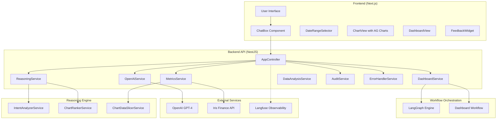

# Iris Finance — Chat → Chart AI Platform

Transform natural language into interactive business charts and dashboards using live Iris Finance data, advanced AI reasoning, and comprehensive observability.

---

## 📋 Table of Contents

- [Overview](#-overview)
- [Key Features](#-key-features)
- [Architecture](#-architecture)
- [Tech Stack](#-tech-stack)
- [Project Structure](#-project-structure)
- [Quick Start](#-quick-start)
- [Configuration](#-configuration)
- [Data Flow](#-data-flow)
- [API Documentation](#-api-documentation)
- [Frontend Components](#-frontend-components)
- [Backend Services](#-backend-services)
- [Advanced Reasoning System](#-advanced-reasoning-system)
- [LangGraph Workflow Orchestration](#-langgraph-workflow-orchestration)
- [Observability & Monitoring](#-observability--monitoring)
- [Data Analysis Engine](#-data-analysis-engine)
- [Iris API Integration](#-iris-api-integration)
- [Audit & Compliance](#-audit--compliance)
- [Testing](#-testing)
- [Deployment](#-deployment)
- [Troubleshooting](#-troubleshooting)

---

## 🌟 Overview

This application converts natural language questions into interactive business visualizations using live Iris Finance data. Users ask questions in plain English, and the system uses advanced AI reasoning to select optimal metrics and chart types, then renders interactive charts and comprehensive dashboards.

### Core Capabilities

- **Natural Language Processing**: Convert plain English to structured chart specifications
- **Live Data Integration**: Real-time data from Iris Finance API with intelligent caching
- **Advanced AI Reasoning**: Multi-step decision making with explainable confidence scoring
- **Smart Chart Selection**: Intelligent chart type recommendations based on data characteristics
- **Interactive Dashboards**: Generate multiple related charts with AI-powered insights
- **Complete Audit Trail**: Comprehensive logging for compliance and analysis
- **Enterprise Observability**: Full tracing and monitoring with Langfuse integration

---

## ✨ Key Features

### AI-Powered Reasoning
- **OpenAI GPT-4 Integration**: Advanced chart generation with step-by-step reasoning
- **Intent Analysis**: Sophisticated natural language understanding with confidence scoring
- **Chart Ranking**: Systematic evaluation of visualization options with explainable results
- **Condensed Reasoning Summaries**: Structured decision explanations with rationale points
- **Fuzzy String Matching**: Levenshtein similarity algorithms for improved metric selection
- **Business Context Integration**: Domain knowledge boosts for financial metrics

### Visualization Capabilities
- **Chart Types**: Line, bar, stacked-bar, heatmap, waterfall
- **Interactive Tables**: AG Grid integration with sorting, filtering, and export
- **Data Formatting**: Automatic currency, percentage, and count formatting
- **Responsive Layout**: Adaptive grid system for dashboard visualization

### Data Intelligence
- **Metric Discovery**: Automatic detection of scalar, time series, grouped series, embedded metrics, dynamic key objects, and arrays
- **Quality Analysis**: Comprehensive data quality assessment with issue detection
- **Flexible Date Ranges**: Support for years, months, days, and custom ISO ranges
- **Semantic Search**: Enhanced metric matching with tokenized relevance scoring

### Enterprise Features
- **Comprehensive Auditing**: Full request/response logging in structured JSON format
- **Feedback System**: User rating collection with aggregated statistics
- **Performance Monitoring**: Response time tracking and optimization insights
- **Error Recovery**: Sophisticated error handling with user-friendly messages

---

## 🏗️ Architecture



---

## 🛠️ Tech Stack

### Backend
- **Framework**: NestJS 10 with TypeScript 5
- **AI Integration**: OpenAI 4 with function calling
- **Workflow Orchestration**: LangChain Core 0.3.68 & LangGraph 0.2.74
- **Observability**: Langfuse 3.17 for comprehensive tracing
- **HTTP Client**: @nestjs/axios with rxjs
- **Validation**: class-validator & class-transformer
- **Documentation**: Swagger/OpenAPI with @nestjs/swagger

### Frontend
- **Framework**: Next.js 13 with React 18
- **Charts**: ag-charts-react 9.0 for visualization
- **Data Tables**: ag-grid-react 34.0 & ag-grid-community 34.0
- **Styling**: CSS-in-JS with responsive design

### Development Tools
- **Runtime**: ts-node with nodemon for development
- **Environment**: dotenv for configuration
- **Type Safety**: Full TypeScript coverage

---

## 📁 Project Structure

```
iris_chat_to_chart/
├── server/                                # NestJS Backend
│   ├── src/
│   │   ├── main.ts                       # Application bootstrap
│   │   ├── app.controller.ts             # Main API controller
│   │   ├── openai.service.ts            # AI integration service
│   │   ├── reasoning.service.ts          # Core reasoning algorithms
│   │   ├── dashboard.service.ts          # Dashboard generation
│   │   ├── dashboard.graph.ts           # LangGraph workflow
│   │   │
│   │   ├── reasoning/                   # Advanced reasoning components
│   │   │   ├── intent-analyzer.service.ts    # NLP intent analysis
│   │   │   └── chart-ranker.service.ts       # Chart type selection
│   │   │
│   │   ├── data/                        # Data processing services
│   │   │   ├── metrics.service.ts            # Metric management
│   │   │   ├── data-analysis.service.ts      # Data discovery
│   │   │   └── chart-data-slicer.service.ts  # Data transformation
│   │   │
│   │   ├── api/                         # External API integration
│   │   │   └── iris-api.service.ts           # Iris Finance API
│   │   │
│   │   ├── audit/                       # Audit and compliance
│   │   │   └── audit.service.ts              # Comprehensive logging
│   │   │
│   │   ├── common/                      # Shared utilities
│   │   │   └── error-handler.service.ts      # Error management
│   │   │
│   │   ├── config/                      # Configuration
│   │   │   └── iris.config.ts               # Iris API config
│   │   │
│   │   ├── dto/                         # Data transfer objects
│   │   │   └── chat.dto.ts                  # API validation
│   │   │
│   │   ├── observability/              # Monitoring and tracing
│   │   │   └── langfuse.ts                  # Langfuse integration
│   │   │
│   │   └── utils/                       # Helper utilities
│   │       └── date-filter.util.ts          # Date processing
│   │
│   ├── audit-logs/                     # Audit log storage (gitignored)
│   ├── package.json                    # Backend dependencies
│   └── tsconfig.json                   # TypeScript configuration
│
├── web/                                # Next.js Frontend
│   ├── components/                     # React components
│   │   ├── ChatBox.tsx                      # User input interface
│   │   ├── DateRangeSelector.tsx           # Date range picker
│   │   ├── ChartView.tsx                    # Chart visualization
│   │   ├── DashboardView.tsx               # Dashboard layout
│   │   └── FeedbackWidget.tsx              # User feedback collection
│   │
│   ├── pages/                          # Next.js pages
│   │   └── index.tsx                        # Main application page
│   │
│   ├── public/                         # Static assets
│   │   └── iris.jpeg                        # Iris Finance logo
│   │
│   ├── package.json                    # Frontend dependencies
│   └── tsconfig.json                   # TypeScript configuration
│
├── README.md                           # This documentation
├── DATAFLOW.md                         # Detailed data flow documentation
└── AUDIT_README.md                     # Audit system documentation
```

---

## 🚀 Quick Start

### Prerequisites
- Node.js 18+
- npm 8+
- OpenAI API key
- Iris Finance API token
- Optional: Langfuse API keys for observability

### 1. Installation
```bash
git clone <repository-url>
cd iris_chat_to_chart

# Install backend dependencies
cd server && npm install

# Install frontend dependencies
cd ../web && npm install
```

### 2. Environment Configuration
Create `server/.env`:
```bash
# Required
OPENAI_API_KEY=sk-...
IRIS_API_TOKEN=your_iris_api_token

# Optional overrides
IRIS_API_URL=https://api.irisfinance.co/metrics
ENABLE_REASONING=true
PORT=4000
NODE_ENV=development

# Optional observability (recommended for production)
LANGFUSE_SECRET_KEY=sk-lf-...
LANGFUSE_PUBLIC_KEY=pk-lf-...
LANGFUSE_BASEURL=https://cloud.langfuse.com
```

### 3. Development Server
```bash
# Terminal 1: Start backend
cd server && npm run dev

# Terminal 2: Start frontend
cd web && npm run dev
```

Access the application at `http://localhost:3000`
API documentation at `http://localhost:4000/docs`

---

## ⚙️ Configuration

### Environment Variables

#### Backend Configuration
- **`OPENAI_API_KEY`** (required): OpenAI API key for GPT-4 access
- **`IRIS_API_TOKEN`** (required): Authentication token for Iris Finance API
- **`IRIS_API_URL`** (optional): Iris API endpoint (defaults to production)
- **`ENABLE_REASONING`** (optional): Enable detailed reasoning logs (`true|false`)
- **`PORT`** (optional): Server port (default: 4000)
- **`NODE_ENV`** (optional): Environment mode (development/production)

#### Observability Configuration
- **`LANGFUSE_SECRET_KEY`** (optional): Langfuse secret key for tracing
- **`LANGFUSE_PUBLIC_KEY`** (optional): Langfuse public key
- **`LANGFUSE_BASEURL`** (optional): Langfuse endpoint URL

### Date Range Formats
The system supports flexible date range inputs:
- **Year**: `2025`
- **Month**: `2025-06`
- **Day**: `2025-06-15`
- **Custom Range**: `2025-01-01,2025-12-31` or ISO format

---

## 🔄 Data Flow

### Single Chart Generation (`POST /v1/chat`)
1. **Request Processing**: Validate user prompt and optional date range
2. **Data Analysis**: Load and analyze Iris Finance data for available metrics
3. **AI Reasoning**: Use GPT-4 to generate chart specification with reasoning
4. **Data Slicing**: Transform raw data into chart-ready format
5. **Audit Logging**: Record complete request/response for compliance
6. **Response**: Return chart specification with data and metadata

### Dashboard Generation (`POST /v1/dashboard`)
1. **Initialization**: Start LangGraph workflow orchestration
2. **Data Analysis**: Discover and analyze all available metrics
3. **Metric Selection**: Use advanced reasoning to identify related metrics
4. **Chart Generation**: Create multiple chart specifications in parallel
5. **Data Processing**: Slice and format data for each chart
6. **Insight Generation**: Create AI-powered dashboard insights
7. **Layout Calculation**: Determine optimal chart positioning
8. **Response Assembly**: Combine all charts with metadata

---

## 📡 API Documentation

### Core Endpoints

#### `POST /v1/chat` - Single Chart Generation
Generate a single chart from natural language input.

**Request Body:**
```json
{
  "prompt": "Show revenue trends for 2025",
  "dateRange": "2025-06"  // Optional
}
```

**Response:**
```json
{
  "chartType": "line",
  "metric": "revenue",
  "dateRange": "2025-06",
  "data": {
    "dates": ["2025-01", "2025-02", "2025-03"],
    "values": [{"label": "Revenue", "values": [10000, 12000, 15000]}]
  },
  "requestId": "1703123456789-abc123",
  "originalPrompt": "Show revenue trends for 2025",
  "reasoning_summary": {
    "intent": "temporal_trend",
    "rationale_points": ["time series data available", "trend analysis requested"],
    "confidence": 0.85,
    "decisions": [
      {"name": "chart_type", "choice": "line", "why": "best for temporal trends"}
    ]
  },
  "dataAnalysis": {
    "totalMetrics": 45,
    "suggestedChartTypes": ["line", "bar"]
  }
}
```

#### `POST /v1/dashboard` - Dashboard Generation
Generate multiple related charts for comprehensive analysis.

**Request Body:**
```json
{
  "prompt": "Executive sales overview",
  "maxCharts": 5,          // Optional, default: 5
  "dateRange": "2025-06",  // Optional
  "generateInsights": true // Optional, default: false
}
```

**Response:**
```json
{
  "dashboardId": "dashboard_1703123456789_xyz",
  "charts": [
    {
      "id": "chart_1",
      "title": "Sales Channel Performance",
      "chartType": "bar",
      "metric": "dataBySalesChannels",
      "dateRange": "2025-06",
      "row": 0,
      "col": 0,
      "span": 4,
      "data": { /* chart data */ }
    }
  ],
  "metadata": {
    "totalCharts": 3,
    "responseTimeMs": 1247,
    "suggestedInsights": [
      "Cross-channel performance comparison enables optimization opportunities",
      "Revenue trends support forecasting and planning decisions"
    ]
  },
  "requestId": "dash_1703123456789_abc",
  "originalPrompt": "Executive sales overview"
}
```

#### `POST /v1/feedback` - Submit User Feedback
Collect user ratings and feedback for generated charts.

**Request Body:**
```json
{
  "requestId": "1703123456789-abc123",
  "rating": 4,           // 1-5 scale
  "comment": "Great visualization!",  // Optional
  "chartId": "chart_1"   // Optional for dashboard charts
}
```

### Monitoring Endpoints

#### `GET /v1/audit/stats` - Audit Statistics
Returns comprehensive statistics about chart generation and usage.

#### `GET /v1/feedback/stats` - Feedback Statistics
Returns aggregated user feedback data and ratings.

#### `GET /v1/reasoning/status` - Reasoning System Status
Returns current status and configuration of the reasoning system.

---

## 🎨 Frontend Components

### Core Components

#### `pages/index.tsx`
Main application page that orchestrates the entire user interface:
- Displays Iris Finance branding and instructions
- Manages state for both single charts and dashboards
- Provides responsive layout with glassmorphism design
- Integrates all major components

#### `components/ChatBox.tsx`
User input interface with advanced features:
- Mode switching between single chart and dashboard generation
- Integrated date range selection
- Real-time API communication with loading states
- Error handling and user feedback
- Smart date range formatting for API compatibility

#### `components/DateRangeSelector.tsx`
Flexible date range picker supporting:
- Preset options (year, month, quarter)
- Custom date range selection
- Automatic format conversion
- Validation and error handling

#### `components/ChartView.tsx`
Interactive chart visualization powered by AG Charts:
- Dynamic chart type rendering (line, bar, stacked-bar, heatmap, waterfall)
- Automatic data formatting (currency, percentage, count)
- Interactive tooltips and legends
- Integrated data table with AG Grid
- Export capabilities
- Responsive design

#### `components/DashboardView.tsx`
Comprehensive dashboard layout manager:
- Grid-based layout system
- Individual chart rendering with titles
- Integrated insights display
- Responsive design for multiple charts
- Chart interaction and feedback collection

#### `components/FeedbackWidget.tsx`
User feedback collection interface:
- 5-star rating system
- Optional comment submission
- Integration with feedback API
- Real-time submission status

---

## 🔧 Backend Services

### Core Services

#### `AppController`
Main API controller implementing all endpoints:
- Versioned API routing (`/v1/*`)
- Comprehensive request validation using DTOs
- Integrated Langfuse tracing
- Error handling and user-friendly error messages
- Swagger/OpenAPI documentation

#### `OpenAiService`
AI integration service with advanced capabilities:
- GPT-4 function calling for structured output
- Multi-step reasoning process
- Condensed reasoning summaries
- Context-aware prompt generation
- Error recovery and fallback strategies

#### `DashboardService`
Dashboard generation orchestration:
- LangGraph workflow integration
- Metric selection and ranking
- Chart specification generation
- Layout calculation and positioning
- AI-powered insight generation

#### `MetricsService`
Data management and processing:
- Iris Finance API integration
- Intelligent caching by date range
- Metric discovery and analysis
- Data transformation and slicing
- Quality assessment and validation

### Specialized Services

#### `ReasoningService`
Advanced reasoning engine with multiple algorithms:
- Fuzzy string matching with Levenshtein distance
- Business context integration
- Diversity-aware metric selection
- Confidence calculation and scoring
- Quality issue detection and reporting

#### `DataAnalysisService`
Comprehensive data analysis capabilities:
- Recursive metric extraction
- Data type detection (scalar, time series, grouped series, etc.)
- Chart type recommendations
- Quality issue identification
- Context generation for AI prompts

#### `AuditService`
Enterprise-grade audit and compliance:
- Structured JSON logging
- Complete request/response capture
- Performance metrics tracking
- Feedback integration
- Statistical reporting

#### `ErrorHandlerService`
Sophisticated error management:
- Error categorization and classification
- User-friendly error message generation
- Logging and monitoring integration
- Recovery strategy suggestions

---

## 🧠 Advanced Reasoning System

The reasoning system provides sophisticated decision-making capabilities through multiple specialized services.

### Intent Analysis (`IntentAnalyzerService`)
Advanced natural language understanding:

**Capabilities:**
- **Complex Query Processing**: Handles conditional statements, multiple clauses, and ambiguous language
- **Temporal Pattern Recognition**: Advanced detection of timeframes and periodicity
- **Intent Classification**: Identifies trends, comparisons, breakdowns, correlations, and anomaly detection
- **Confidence Scoring**: Evidence-based confidence calculation with multi-factor analysis
- **Keyword Extraction**: Semantic keyword identification and relevance scoring

**Example Analysis:**
```typescript
const analysis = await intentAnalyzer.performIntentAnalysis(
  "Compare Q4 sales performance across channels and identify top performers"
);
// Result:
{
  primaryIntent: { type: "categorical_comparison", confidence: 0.88 },
  secondaryIntents: [
    { type: "performance_ranking", confidence: 0.72 },
    { type: "temporal_focus", confidence: 0.65 }
  ],
  temporalSignals: [
    { type: "quarterly", confidence: 0.9, keyword: "Q4" }
  ],
  explicitMetrics: ["sales", "performance", "channels"]
}
```

### Chart Ranking (`ChartRankerService`)
Systematic chart type evaluation and selection:

**Features:**
- **Weighted Scoring**: Evaluates data compatibility, intent alignment, and visual effectiveness
- **Evidence-Based Confidence**: Descriptive levels (Excellent, Good, Acceptable, Poor, Unsuitable)
- **Top-K Selection**: Returns ranked recommendations with detailed reasoning
- **Explainable Results**: Provides strengths, weaknesses, and justifications

**Ranking Factors:**
- Data type compatibility (temporal, categorical, numerical)
- Intent alignment (comparison, trend, composition)
- Visual effectiveness and clarity
- User experience and interpretability

### Core Reasoning Engine (`ReasoningService`)
Comprehensive decision synthesis:

**Advanced Algorithms:**
- **Fuzzy String Matching**: Levenshtein similarity for improved metric matching
- **Business Context Integration**: Domain knowledge boosts for financial metrics
- **Diversity Optimization**: Ensures varied metric selection across types
- **Quality Assessment**: Comprehensive analysis of data quality issues
- **Confidence Calculation**: Multi-factor confidence scoring with conservative baselines

**Configuration:**
Enable detailed reasoning with `ENABLE_REASONING=true` for:
- Step-by-step decision logging
- Confidence score breakdowns
- Quality issue identification
- Performance timing analysis

---

## 🔗 LangGraph Workflow Orchestration

The system uses LangGraph for sophisticated workflow management in dashboard generation.

### Workflow Architecture (`dashboard.graph.ts`)
Structured multi-step process:

1. **Initialization**: Dashboard ID generation and timing setup
2. **Data Analysis**: Comprehensive metric discovery and quality assessment
3. **Metric Selection**: Advanced reasoning-based selection with diversity optimization
4. **Spec Generation**: Parallel chart specification creation with AI integration
5. **Data Fetching**: Optimized data processing with caching and transformation
6. **Insights Computation**: AI-powered contextual insights generation
7. **Finalization**: Response assembly with metadata and performance metrics

### State Management
Comprehensive state tracking with:
- **Reducers**: Clean state transformation patterns
- **Default Values**: Robust initialization and error handling
- **Node Communication**: Efficient data passing between workflow steps
- **Error Recovery**: Graceful handling of workflow failures

### Benefits
- **Scalability**: Easy addition of new processing steps
- **Observability**: Full visibility into workflow execution
- **Maintainability**: Clear separation of workflow and business logic
- **Extensibility**: Framework for complex conditional logic and parallel processing

---

## 📊 Observability & Monitoring

### Langfuse Integration (`langfuse.ts`)
Comprehensive tracing and monitoring:

**Trace Types:**
- **Endpoint Traces**: Complete request/response cycles
- **AI Interaction Traces**: OpenAI API calls with reasoning steps
- **Workflow Traces**: LangGraph step execution and timing
- **Performance Traces**: Response times and optimization insights

**Monitoring Capabilities:**
- Request pattern analysis
- AI performance optimization
- Error rate tracking with categorization
- Custom tags for filtering and analysis
- Real-time system health monitoring

### Performance Metrics
Automatic collection of:
- Response time distributions
- AI reasoning confidence trends
- Cache hit/miss ratios
- Error categorization and frequency
- User satisfaction metrics

### Error Tracking
Sophisticated error management:
- **Categorization**: API, validation, AI, and system errors
- **Severity Assessment**: Critical, warning, and informational levels
- **Context Preservation**: Complete error context for debugging
- **Recovery Suggestions**: Automated recommendation generation

---

## 🔍 Data Analysis Engine

### Metric Discovery (`DataAnalysisService`)
Advanced data structure analysis:

**Metric Types Detected:**
- **Scalar**: Single numerical values
- **Time Series**: Temporal data with date/value pairs
- **Grouped Series**: Multi-dimensional time series data
- **Embedded Metrics**: Objects containing multiple related metrics
- **Dynamic Key Objects**: Objects with variable key structures
- **Arrays**: List-based data structures

**Quality Analysis:**
- **Unknown Categories**: Identification of unlabeled data
- **Type Inconsistencies**: Detection of mixed value types
- **Temporal Validation**: Time series completeness checks
- **Categorization Assessment**: Evaluation of grouping effectiveness

### Data Transformation (`ChartDataSlicerService`)
Strategy pattern implementation for data processing:

**Slicing Strategies:**
- **TimeSeriesSlicingStrategy**: Temporal data with date filtering
- **GroupedSeriesSlicingStrategy**: Multi-dimensional grouping
- **ScalarSlicingStrategy**: Single value processing
- **DynamicKeyObjectSlicingStrategy**: Variable structure handling
- **EmbeddedMetricsSlicingStrategy**: Nested metric extraction
- **ArraySlicingStrategy**: List data processing

---

## 🌐 Iris API Integration

### `IrisApiService`
Robust external API integration:

**Features:**
- **Authentication**: Secure token-based API access
- **Date Range Processing**: Flexible date format conversion
- **Error Handling**: Comprehensive status and data validation
- **Header Management**: Browser-like request headers for compatibility
- **Response Processing**: Data validation and structure verification

**Supported Date Formats:**
- Year: `2025` → `2025-01-01T00:00:00.000Z` to `2025-12-31T23:59:59.999Z`
- Month: `2025-06` → `2025-06-01T00:00:00.000Z` to `2025-06-30T23:59:59.999Z`
- Day: `2025-06-15` → `2025-06-15T00:00:00.000Z` to `2025-06-15T23:59:59.999Z`
- Custom: `startDate,endDate` → ISO format conversion

### Caching Strategy
Intelligent data caching:
- **Cache Key Generation**: Based on date range and parameters
- **Invalidation**: Smart cache refresh policies
- **Performance Optimization**: Reduced API calls and improved response times

---

## 🔒 Audit & Compliance

### Comprehensive Logging (`AuditService`)
Enterprise-grade audit trail:

**Log Contents:**
- Complete request/response data
- AI reasoning steps and decisions
- Data usage tracking
- Performance metrics
- User feedback integration
- Quality issue reporting

**File Structure:**
```json
{
  "timestamp": "2025-08-25T10:30:00.000Z",
  "requestId": "1703123456789-abc123",
  "userPrompt": "Show revenue trends",
  "chartSpec": { /* complete specification */ },
  "dataUsed": { /* chart data with metadata */ },
  "dataAnalysis": { /* analysis results */ },
  "metadata": {
    "dataSource": "Iris Finance API",
    "responseTimeMs": 847,
    "metricsCount": 3,
    "qualityIssues": []
  }
}
```

### Security Considerations
- **Data Privacy**: Audit logs contain sensitive business data
- **File Permissions**: Restricted access to audit directory
- **Retention Policies**: Configurable log retention periods
- **Compliance**: Support for regulatory requirements

### Feedback System
User satisfaction tracking:
- **Rating Collection**: 1-5 scale with comments
- **Statistical Analysis**: Aggregated performance metrics
- **Quality Monitoring**: Correlation between feedback and technical metrics

---

## 🧪 Testing

### Manual Testing Scripts
```bash
# Health check with comprehensive metrics
curl http://localhost:4000/v1/audit/stats

# Reasoning system status
curl http://localhost:4000/v1/reasoning/status

# Single chart generation
curl -X POST http://localhost:4000/v1/chat \
  -H 'Content-Type: application/json' \
  -d '{"prompt":"Show sales trends","dateRange":"2025-06"}'

# Dashboard generation
curl -X POST http://localhost:4000/v1/dashboard \
  -H 'Content-Type: application/json' \
  -d '{"prompt":"Executive overview","maxCharts":3,"generateInsights":true}'

# Feedback submission
curl -X POST http://localhost:4000/v1/feedback \
  -H 'Content-Type: application/json' \
  -d '{"requestId":"1703123456789-abc123","rating":5,"comment":"Excellent chart!"}'
```

### API Documentation
Interactive API documentation available at `http://localhost:4000/docs` with:
- Complete endpoint specifications
- Request/response examples
- Interactive testing interface
- Authentication requirements
- Error code documentation

---

## 🚀 Deployment

### Backend Production Build
```bash
cd server
npm run build
NODE_ENV=production npm start
```

### Frontend Production Build
```bash
cd web
npm run build
npm start
```

### Production Environment Variables
```bash
# Core configuration
OPENAI_API_KEY=prod_openai_key
IRIS_API_TOKEN=prod_iris_token
IRIS_API_URL=https://api.irisfinance.co/metrics
NODE_ENV=production
PORT=4000

# Performance optimization
ENABLE_REASONING=false  # Disable verbose logging

# Enterprise monitoring (recommended)
LANGFUSE_SECRET_KEY=sk-lf-prod-...
LANGFUSE_PUBLIC_KEY=pk-lf-prod-...
LANGFUSE_BASEURL=https://cloud.langfuse.com
```

### Infrastructure Requirements
- **Node.js**: 18+ for optimal performance
- **Memory**: Minimum 2GB RAM for concurrent AI processing
- **Storage**: SSD recommended for audit log performance
- **Network**: Outbound HTTPS access for OpenAI and Iris APIs

---

## 🐛 Troubleshooting

### Common Issues and Solutions

#### OpenAI API Errors
- **Symptoms**: "OpenAI error" or "tool call failed" messages
- **Solutions**: 
  - Verify `OPENAI_API_KEY` is valid and has credits
  - Test API connectivity: `curl https://api.openai.com/v1/models -H "Authorization: Bearer $OPENAI_API_KEY"`
  - Check network firewall rules for outbound HTTPS

#### Iris API Connection Issues
- **Symptoms**: "Failed to fetch metrics" errors
- **Solutions**:
  - Verify `IRIS_API_TOKEN` is current and valid
  - Check API endpoint availability
  - Review server logs for detailed error information

#### Date Range Validation Errors
- **Symptoms**: "Invalid date range format" messages
- **Solutions**:
  - Use supported formats: `YYYY`, `YYYY-MM`, `YYYY-MM-DD`, or `startISO,endISO`
  - Ensure custom ranges use comma separation
  - Verify date values are realistic and within data availability

#### Reasoning System Issues
- **Symptoms**: Missing reasoning data or analysis failures
- **Solutions**:
  - Verify `ENABLE_REASONING` configuration
  - Check `/v1/reasoning/status` endpoint
  - Review console logs for detailed reasoning steps

#### Performance Issues
- **Symptoms**: Slow response times or timeouts
- **Solutions**:
  - Monitor Langfuse traces for bottleneck identification
  - Check cache hit rates in audit statistics
  - Review concurrent request limits
  - Optimize date range selections for better caching

#### Dashboard Generation Failures
- **Symptoms**: Incomplete dashboards or workflow errors
- **Solutions**:
  - Check LangGraph workflow logs
  - Verify all service dependencies are properly injected
  - Review metric selection and ranking processes
  - Validate AI service availability and limits

---

## 📚 Additional Resources

- **OpenAI Platform Documentation**: [https://platform.openai.com/docs](https://platform.openai.com/docs)
- **NestJS Framework Documentation**: [https://docs.nestjs.com](https://docs.nestjs.com)
- **Next.js React Framework**: [https://nextjs.org/docs](https://nextjs.org/docs)
- **AG Charts Visualization Library**: [https://charts.ag-grid.com](https://charts.ag-grid.com)
- **AG Grid Data Tables**: [https://ag-grid.com/documentation](https://ag-grid.com/documentation)
- **LangChain Core Framework**: [https://langchain.com/docs](https://langchain.com/docs)
- **LangGraph Workflow Engine**: [https://langchain-ai.github.io/langgraph/](https://langchain-ai.github.io/langgraph/)
- **Langfuse Observability Platform**: [https://langfuse.com/docs](https://langfuse.com/docs)

---

**Built with Next.js, NestJS, OpenAI GPT-4, LangChain, LangGraph, Langfuse, AG Charts, and AG Grid**

*Transform your business data into actionable insights with AI-powered natural language processing and intelligent visualization.*