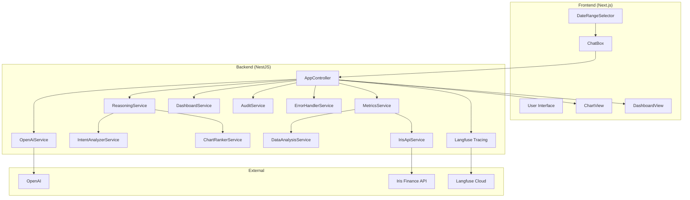

## 🎯 Iris Finance — Chat → Chart AI Platform

Transform natural language into business charts and dashboards with live Iris data, OpenAI-assisted chart specs, and a transparent reasoning engine with LangGraph integration.

---

## 📋 Table of Contents

- **Overview**
- **Key Features**
- **Architecture**
- **Tech Stack**
- **Project Structure**
- **Quick Start**
- **Configuration**
- **How It Works (Data & Reasoning Flows)**
- **API Documentation**
- **Frontend Components**
- **Data Analysis Engine**
- **Dashboard System**
- **Reasoning System**
- **LangGraph Integration**
- **Observability & Monitoring**
- **Iris API Integration**
- **Audit & Compliance**
- **Testing**
- **Deployment**
- **Troubleshooting**
- **Additional Resources**

---

## 🌟 Overview

This app converts plain-English questions into visual insights. Users ask questions, the backend discovers metrics from live Iris Finance data, the AI selects the best visualization and metric, and the frontend renders interactive charts and dashboards. The reasoning system provides sophisticated intent analysis and chart ranking with explainable selection processes.

### Core capabilities
- **Chat to Chart**: Natural language → structured chart spec
- **Live Data**: Pulls from Iris Finance API with caching and flexible date ranges
- **Metric Discovery**: Deep analysis over nested, embedded, and dynamic metrics
- **Dashboards**: Generates multiple related charts, ranked by prompt relevance
- **Transparent Reasoning**: Deterministic, explainable selection with intent analysis
- **LangGraph Integration**: Structured workflow orchestration for complex queries
- **Full Audit Trail**: Request, spec, data, and metadata saved to disk
- **Observability**: Langfuse integration for monitoring and tracing

---

## ✨ Key Features

### AI and Reasoning
- **OpenAI-assisted decisions** in `OpenAiService` with explicit step-by-step chain-of-thought output captured as `aiReasoning`.
- **Intent Analysis** in `IntentAnalyzerService` for sophisticated natural language understanding including temporal patterns, negation handling, and complex query preprocessing.
- **Chart Ranking** in `ChartRankerService` for systematic chart type selection with weighted scoring criteria.
- **Deterministic reasoning** in `ReasoningService` for final decision synthesis and confidence scoring.
- **Toggle** with `ENABLE_REASONING=true` to emit reasoning steps and console logs.

### Visualization
- **Chart types**: `line`, `bar`, `stacked-bar`, `heatmap`, `waterfall`.
- **Tables**: Interactive `ag-grid` data table for every chart.
- **Formatting**: Automatic currency/percentage/count formatting.

### Data and Dashboards
- **Data types**: `scalar`, `timeSeries`, `groupedSeries`, `embeddedMetrics`, `dynamicKeyObject`, `array`.
- **Flexible date ranges**: Year, month, single day, ISO range, and custom range support.
- **Dashboard ranking**: Prompt-driven, quality-aware metric selection.

### Enterprise & Observability
- **Audit logs** in `server/audit-logs/` with full context.
- **Langfuse tracing** for request monitoring and AI interaction tracking.
- **Error handling** with comprehensive error recovery and reporting.
- **Endpoints** for feedback, audit stats, and reasoning status.

---

## 🏗️ Architecture



---

## 🛠️ Tech Stack

### Backend
- **NestJS 10**, **TypeScript 5**, **OpenAI 4**, **@nestjs/axios**, **rxjs**
- **LangChain Core & LangGraph** for workflow orchestration
- **Langfuse** for observability and tracing
- **Swagger** for API documentation

### Frontend
- **Next.js 13**, **React 18**, **ag-charts-react**, **ag-grid-react**, **ag-grid-community**

### Tooling
- **ts-node**, **nodemon**, **dotenv**

---

## 📁 Project Structure

```
iris_chat_to_chart/
├─ server/
│  ├─ src/
│  │  ├─ main.ts
│  │  ├─ app.controller.ts
│  │  ├─ openai.service.ts
│  │  ├─ reasoning.service.ts
│  │  ├─ dashboard.service.ts
│  │  ├─ reasoning/
│  │  │  ├─ intent-analyzer.service.ts
│  │  │  └─ chart-ranker.service.ts
│  │  ├─ data/
│  │  │  ├─ metrics.service.ts
│  │  │  ├─ data-analysis.service.ts
│  │  │  └─ chart-data-slicer.service.ts
│  │  ├─ api/
│  │  │  └─ iris-api.service.ts
│  │  ├─ audit/
│  │  │  └─ audit.service.ts
│  │  ├─ common/
│  │  │  └─ error-handler.service.ts
│  │  ├─ config/
│  │  │  └─ iris.config.ts
│  │  ├─ dto/
│  │  │  └─ chat.dto.ts
│  │  ├─ observability/
│  │  │  └─ langfuse.ts
│  │  ├─ utils/
│  │  │  └─ date-filter.util.ts
│  │  └─ dashboard.graph.ts
│  ├─ audit-logs/
│  ├─ package.json
│  └─ tsconfig.json
├─ web/
│  ├─ components/
│  │  ├─ ChatBox.tsx
│  │  ├─ DateRangeSelector.tsx
│  │  ├─ ChartView.tsx
│  │  ├─ DashboardView.tsx
│  │  └─ FeedbackWidget.tsx
│  ├─ pages/index.tsx
│  ├─ package.json
│  └─ tsconfig.json
├─ README.md
└─ AUDIT_README.md
```

---

## 🚀 Quick Start

### Prerequisites
- Node.js 18+
- npm 8+
- OpenAI API key
- Iris API token
- Optional: Langfuse API keys for observability

### 1) Install
```bash
git clone <your-repo-url>
cd iris_chat_to_chart

cd server && npm install
cd ../web && npm install
```

### 2) Configure backend env
Create `server/.env`:
```bash
OPENAI_API_KEY=sk-...
IRIS_API_TOKEN=your_iris_api_token
# Optional overrides
IRIS_API_URL=https://api.irisfinance.co/metrics
ENABLE_REASONING=true
PORT=4000
NODE_ENV=development

# Optional: Langfuse observability
LANGFUSE_SECRET_KEY=sk-lf-...
LANGFUSE_PUBLIC_KEY=pk-lf-...
LANGFUSE_BASEURL=https://cloud.langfuse.com
```

### 3) Run
```bash
# Terminal A (backend)
cd server && npm run dev

# Terminal B (frontend)
cd web && npm run dev
```

Open `http://localhost:3000`.

---

## ⚙️ Configuration

### Backend environment
- **`OPENAI_API_KEY`**: required for OpenAI.
- **`IRIS_API_TOKEN`**: required for Iris API calls.
- **`IRIS_API_URL`**: Iris endpoint (defaults to production).
- **`ENABLE_REASONING`**: `true|false` to emit reasoning steps and status.
- **`LANGFUSE_SECRET_KEY`**, **`LANGFUSE_PUBLIC_KEY`**, **`LANGFUSE_BASEURL`**: optional Langfuse tracing.
- **`PORT`**, **`NODE_ENV`**: standard server config.

### Date ranges accepted
- Year: `YYYY`
- Month: `YYYY-MM`
- Day: `YYYY-MM-DD`
- Custom range: `startISO,endISO` or `YYYY-MM-DD,YYYY-MM-DD` (auto-ISO expanded)

---

## 🔄 How It Works (Data & Reasoning Flows)

### Single chart flow (`POST /chat`)
1. `MetricsService.getDataAnalysis(dateRange)`
   - `IrisApiService.fetchMetrics()` loads live data and caches by date range.
   - `DataAnalysisService.analyzeData()` discovers metrics and suggests chart types.
2. `ReasoningService.generateReasoning()`
   - `IntentAnalyzerService.performIntentAnalysis()` performs sophisticated natural language understanding.
   - `ChartRankerService.generateTopKCharts()` systematically ranks chart types with weighted scoring.
   - Creates a deterministic reasoning object with steps and confidence.
3. `OpenAiService.prompt()`
   - Generates explicit reasoning text (`aiReasoning`).
   - Performs a tool call to produce a structured chart spec.
4. `MetricsService.slice()`
   - Slices the requested metric into a common chart data shape.
5. `AuditService.logChartGeneration()`
   - Persists request, spec, data, analysis, and metadata.

### Dashboard flow (`POST /dashboard`)
1. `MetricsService.getDataAnalysis()` → metric catalog.
2. `DashboardService.identifyRelatedMetrics()`
   - Uses `ReasoningService.analyzeAndRankMetrics()` to score and rank metrics related to the prompt.
   - Logs metric quality issues (e.g., too many unknown categories).
3. `DashboardService.generateChartSpecs()`
   - For each metric, uses `OpenAiService` to produce a chart spec; falls back to sane defaults.
4. `MetricsService.slice()` per spec → `charts[]` array with layout metadata.
5. Optional insights synthesized by `DashboardService`.

---

## 📡 API Documentation

### POST `/chat`
Body (`ChatDto`):
```json
{ "prompt": "Compare revenue by sales channel", "dateRange": "2025-06" }
```
Response (abridged):
```json
{
  "chartType": "bar",
  "metric": "dataBySalesConnectors.grossSales",
  "dateRange": "2025-06",
  "data": { "dates": [...], "values": [...] },
  "requestId": "...",
  "originalPrompt": "...",
  "dataAnalysis": { "totalMetrics": 99, "suggestedChartTypes": ["bar","line"], "runtimeReasoning": true },
  "reasoning": { "enabled": true, "steps": [...], "summary": {...}, "metadata": {...}, "aiReasoning": "..." }
}
```

### POST `/dashboard`
Body (`DashboardDto`):
```json
{ "prompt": "Executive sales overview", "maxCharts": 5, "dateRange": "2025-06", "generateInsights": true }
```
Response: `dashboardId`, `charts[]`, `metadata`, `requestId`, `originalPrompt`.

### POST `/feedback`
Body (`FeedbackDto`): `{ requestId, rating (1..5), comment?, chartId? }` → OK.

### GET `/feedback/stats`
Aggregated feedback statistics.

### GET `/audit/stats`
Audit summary (totals, today, breakdowns, avg response time, top metrics).

### GET `/reasoning/status`
Runtime toggle/health for the reasoning system.

---

## 🎨 Frontend Components
- **`pages/index.tsx`**: Orchestrates `ChatBox`, `ChartView`, `DashboardView`.
- **`components/ChatBox.tsx`**: Mode toggle (single/dashboard), date range picker, calls backend.
- **`components/DateRangeSelector.tsx`**: Outputs `YYYY`, `YYYY-MM`, `YYYY-MM-DD`, or `start,end` strings.
- **`components/ChartView.tsx`**: AG Charts config, tooltips, formatting, and `ag-grid` table.
- **`components/DashboardView.tsx`**: Renders list of charts with titles/insights and `ChartView` instances.
- **`components/FeedbackWidget.tsx`**: Sends user ratings back to `/feedback`.

---

## 🔍 Data Analysis Engine
- File: `server/src/data/data-analysis.service.ts`
- Discovers metrics across nested objects, arrays of objects (embedded metrics), and dynamic key objects.
- Produces:
  - `availableMetrics: MetricInfo[]`
  - `suggestedChartTypes: ChartSuggestion[]` (guided hints for the AI)
  - `dataContext: string` (compact data description for prompts)

Metric types detected:
- `scalar`, `timeSeries`, `groupedSeries`, `embeddedMetrics`, `dynamicKeyObject`, `array`

---

## 📊 Dashboard System
- File: `server/src/dashboard.service.ts`
- Uses `ReasoningService.analyzeAndRankMetrics()` to select visualizable metrics (excludes scalars), logs quality issues, then generates specs per metric through `OpenAiService` with robust fallbacks and titles.

---

## 🧠 Reasoning System
- **Main Service**: `server/src/reasoning.service.ts`
- **Intent Analysis**: `server/src/reasoning/intent-analyzer.service.ts`
- **Chart Ranking**: `server/src/reasoning/chart-ranker.service.ts`
- Toggle via `ENABLE_REASONING=true`.

### Intent Analysis Capabilities:
- **Complex Query Processing**: Handles conditional statements, multiple clauses, negations, and ambiguous language
- **Temporal Pattern Recognition**: Advanced detection of timeframes, periodicity signals, and temporal comparisons
- **Intent Classification**: Detects temporal trends, categorical comparisons, compositional breakdowns, correlation analysis, performance overviews, anomaly detection, forecasting, and drill-down requirements
- **Semantic Understanding**: Goes beyond keyword matching with contextual analysis and confidence scoring

### Chart Ranking Features:
- **Systematic Scoring**: Weighted evaluation based on data compatibility, intent alignment, visual effectiveness, and usability
- **Top-K Selection**: Returns ranked list of chart recommendations with detailed reasoning
- **Data-Driven Decisions**: Considers metric types, grouping dimensions, temporal data availability, and data quality
- **Explainable Results**: Provides strengths, weaknesses, and reasoning for each chart type recommendation

### Overall Reasoning:
- Final decision synthesis with confidence and key factors
- Quality analysis: unknown categories, too many categories, generic value types, etc.
- Exposes `getReasoningStatus()` and console logging for step-by-step traces

---

## 🔗 LangGraph Integration
- File: `server/src/dashboard.graph.ts`
- Provides structured workflow orchestration for complex multi-step reasoning tasks
- Integrates with LangChain core for advanced AI workflow management
- Enables sophisticated query processing and decision trees

---

## 📊 Observability & Monitoring
- **Langfuse Integration**: `server/src/observability/langfuse.ts`
- **Tracing**: Automatic trace generation for AI interactions and request flows
- **Monitoring**: Track request patterns, AI performance, and system health
- **Error Tracking**: Comprehensive error handling with `ErrorHandlerService`
- **Configuration**: Optional via environment variables - gracefully degrades if not configured

Features:
- Request tracing with input/output capture
- AI interaction monitoring
- Performance metrics collection
- Error rate tracking
- Custom tags for filtering and analysis

---

## 🌐 Iris API Integration
- File: `server/src/api/iris-api.service.ts`
- Requires `IRIS_API_TOKEN`. Optional `IRIS_API_URL`.
- Builds filters payload, sets browser-like headers, posts via `@nestjs/axios`.
- `parseDateRange()` supports: year, month, day, ISO strings, custom ranges.
- Errors include status/data when available for easier debugging.

`MetricsService` caches responses by date range and converts raw data to a normalized chart shape via type-specific slicers:
- `sliceTimeSeries`, `sliceGroupedSeries`, `sliceNestedGroupedSeries`, `sliceScalar`, `sliceDynamicKeyObject`, `sliceEmbeddedMetrics`, `sliceArray`.

---

## 🔒 Audit & Compliance
- File: `server/src/audit/audit.service.ts`
- Logs each request to `server/audit-logs/` with: prompt, spec, data sample, analysis summary, metadata (response time, metrics count).
- See `AUDIT_README.md` for format and operations.

Security notes:
- Logs include sensitive business data; directory is `.gitignore`d.
- Ensure proper file permissions and retention policies.

---

## 🧪 Testing
Manual checks:
```bash
# Server health
curl http://localhost:4000/audit/stats | cat

# Reasoning status
curl http://localhost:4000/reasoning/status | cat

# Single chart
curl -X POST http://localhost:4000/chat \
  -H 'Content-Type: application/json' \
  -d '{"prompt":"Show sales trends","dateRange":"2025-06"}' | cat
```

---

## 🚀 Deployment

### Backend
```bash
cd server
npm run build
NODE_ENV=production npm start
```

### Frontend
```bash
cd web
npm run build
npm start
```

Recommended env (server):
```bash
OPENAI_API_KEY=prod_openai
IRIS_API_TOKEN=prod_iris
IRIS_API_URL=https://api.irisfinance.co/metrics
ENABLE_REASONING=false
NODE_ENV=production
PORT=4000

# Optional: Production observability
LANGFUSE_SECRET_KEY=sk-lf-prod-...
LANGFUSE_PUBLIC_KEY=pk-lf-prod-...
LANGFUSE_BASEURL=https://cloud.langfuse.com
```

---

## 🐛 Troubleshooting
- **OpenAI errors**: verify `OPENAI_API_KEY` and outbound network; test `curl https://api.openai.com/v1/models` with Bearer token.
- **Iris API errors**: verify `IRIS_API_TOKEN`; inspect server logs for response status/data.
- **Date range invalid**: follow accepted formats; custom ranges must be `startISO,endISO` or `YYYY-MM-DD,YYYY-MM-DD`.
- **Metric not found**: check available metrics in error message; try a broader keyword.
- **Reasoning system issues**: check `ENABLE_REASONING` setting; verify reasoning service status via `/reasoning/status`.
- **Langfuse connection**: optional service - application works without it; check environment variables if tracing needed.

---

## 📚 Additional Resources
- [OpenAI API Documentation](https://platform.openai.com/docs)
- [NestJS Documentation](https://docs.nestjs.com)
- [Next.js Documentation](https://nextjs.org/docs)
- [AG Charts Documentation](https://charts.ag-grid.com)
- [AG Grid Documentation](https://ag-grid.com/documentation)
- [LangChain Documentation](https://langchain.com/docs)
- [Langfuse Documentation](https://langfuse.com/docs)

---

Built with Next.js, NestJS, OpenAI, LangChain, LangGraph, Langfuse, ag‑charts, and ag‑grid.