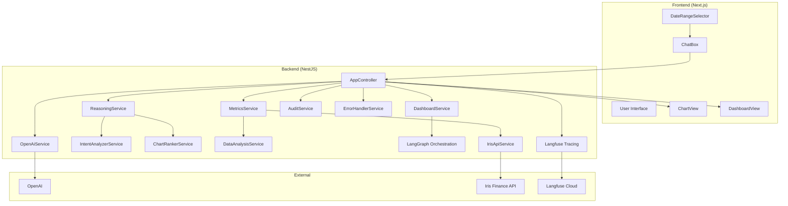

## 🎯 Iris Finance — Chat → Chart AI Platform

Transform natural language into business charts and dashboards with live Iris data, OpenAI-assisted chart specs, and a transparent reasoning engine with LangGraph integration.

---

## 📋 Table of Contents

- **Overview**
- **Key Features**
- **Architecture**
- **Tech Stack**
- **Project Structure**
- **Quick Start**
- **Configuration**
- **How It Works (Data & Reasoning Flows)**
- **API Documentation**
- **Frontend Components**
- **Data Analysis Engine**
- **Dashboard System**
- **Advanced Reasoning System**
- **LangGraph Workflow Orchestration**
- **Observability & Monitoring**
- **Iris API Integration**
- **Audit & Compliance**
- **Testing**
- **Deployment**
- **Troubleshooting**
- **Additional Resources**

---

## 🌟 Overview

This app converts plain-English questions into visual insights. Users ask questions, the backend discovers metrics from live Iris Finance data, the AI selects the best visualization and metric, and the frontend renders interactive charts and dashboards. The reasoning system provides sophisticated intent analysis and chart ranking with explainable selection processes.

### Core capabilities
- **Chat to Chart**: Natural language → structured chart spec with advanced reasoning
- **Live Data**: Pulls from Iris Finance API with caching and flexible date ranges
- **Metric Discovery**: Deep analysis over nested, embedded, and dynamic metrics with quality assessment
- **Smart Dashboards**: Generates multiple related charts, ranked by prompt relevance with diversity optimization
- **Transparent Reasoning**: Deterministic, explainable selection with advanced intent analysis and fuzzy matching
- **LangGraph Orchestration**: Structured workflow management for complex multi-step dashboard generation
- **Full Audit Trail**: Request, spec, data, and metadata saved to disk with comprehensive logging
- **Enterprise Observability**: Langfuse integration for monitoring, tracing, and performance analysis

---

## ✨ Key Features

### Advanced AI and Reasoning
- **OpenAI-assisted decisions** in `OpenAiService` with explicit step-by-step chain-of-thought output captured as `aiReasoning`
- **Condensed Reasoning Summaries** with structured intent analysis, rationale points, confidence scoring, and decision explanations in response format
- **Enhanced Metric Selection** with semantic mapping, tokenized search, and contextual prompts for improved AI chart generation
- **Sophisticated Intent Analysis** in `IntentAnalyzerService` for advanced natural language understanding including:
  - Complex query processing with conditional statements and multiple clauses
  - Advanced temporal pattern recognition and periodicity detection
  - Intent classification for trends, comparisons, breakdowns, correlations, and anomaly detection
  - Semantic understanding with contextual analysis and confidence scoring
- **Advanced Chart Ranking** in `ChartRankerService` for systematic chart type selection with:
  - Weighted evaluation based on data compatibility, intent alignment, and visual effectiveness
  - Evidence-based confidence levels with descriptive ratings (Excellent, Good, Acceptable, Poor, Unsuitable)
  - Top-K selection with detailed reasoning and explainable results
  - Data-driven decisions considering metric types and temporal availability
- **Comprehensive Reasoning** in `ReasoningService` for final decision synthesis with:
  - Fuzzy string matching and Levenshtein similarity algorithms
  - Business context boosts and domain knowledge integration  
  - Diversity-aware metric selection with quality issue detection
  - Sophisticated confidence calculation and metric analysis ranking
- **Toggle** with `ENABLE_REASONING=true` to emit reasoning steps and console logs

### Visualization
- **Chart types**: `line`, `bar`, `stacked-bar`, `heatmap`, `waterfall`
- **Tables**: Interactive `ag-grid` data table for every chart
- **Formatting**: Automatic currency/percentage/count formatting

### Data and Dashboards
- **Data types**: `scalar`, `timeSeries`, `groupedSeries`, `embeddedMetrics`, `dynamicKeyObject`, `array`
- **Flexible date ranges**: Year, month, single day, ISO range, and custom range support
- **Smart Dashboard ranking**: Prompt-driven, quality-aware metric selection with deduplication and semantic matching
- **Contextual Chart Generation**: Metrics analyzed with original user intent, value types, categories, and recommended chart types
- **Enhanced Insights Generation**: AI-powered contextual insights, financial domain knowledge, and composition analysis

### Enterprise & Observability
- **Comprehensive Audit logs** in `server/audit-logs/` with full context and chart data usage logging
- **Advanced Langfuse tracing** for request monitoring and AI interaction tracking
- **Sophisticated Error handling** with comprehensive error recovery, reporting, and logging
- **Rich Endpoints** for feedback, audit stats, and reasoning status monitoring

---

## 🏗️ Architecture



---

## 🛠️ Tech Stack

### Backend
- **NestJS 10**, **TypeScript 5**, **OpenAI 4**, **@nestjs/axios**, **rxjs**
- **LangChain Core 0.3.68 & LangGraph 0.2.74** for workflow orchestration and AI workflow management
- **Langfuse 3.17** for comprehensive observability and tracing
- **Swagger** for API documentation

### Frontend
- **Next.js 13**, **React 18**, **ag-charts-react 9.0**, **ag-grid-react 34.0**, **ag-grid-community 34.0**

### Tooling
- **ts-node**, **nodemon**, **dotenv**

---

## 📁 Project Structure

```
iris_chat_to_chart/
├─ server/
│  ├─ src/
│  │  ├─ main.ts
│  │  ├─ app.controller.ts
│  │  ├─ openai.service.ts
│  │  ├─ reasoning.service.ts                 ← Advanced algorithms & fuzzy matching
│  │  ├─ dashboard.service.ts                 ← LangGraph integration & AI insights
│  │  ├─ dashboard.graph.ts                   ← LangGraph workflow orchestration
│  │  ├─ reasoning/
│  │  │  ├─ intent-analyzer.service.ts        ← Complex query processing
│  │  │  └─ chart-ranker.service.ts           ← Systematic scoring system
│  │  ├─ data/
│  │  │  ├─ metrics.service.ts
│  │  │  ├─ data-analysis.service.ts
│  │  │  └─ chart-data-slicer.service.ts
│  │  ├─ api/
│  │  │  └─ iris-api.service.ts
│  │  ├─ audit/
│  │  │  └─ audit.service.ts                  ← Comprehensive logging
│  │  ├─ common/
│  │  │  └─ error-handler.service.ts
│  │  ├─ config/
│  │  │  └─ iris.config.ts
│  │  ├─ dto/
│  │  │  └─ chat.dto.ts
│  │  ├─ observability/
│  │  │  └─ langfuse.ts                       ← Enhanced observability
│  │  ├─ utils/
│  │  │  └─ date-filter.util.ts
│  ├─ audit-logs/                             ← Chart data usage tracking
│  ├─ package.json
│  └─ tsconfig.json
├─ web/
│  ├─ components/
│  │  ├─ ChatBox.tsx
│  │  ├─ DateRangeSelector.tsx
│  │  ├─ ChartView.tsx
│  │  ├─ DashboardView.tsx
│  │  └─ FeedbackWidget.tsx
│  ├─ pages/index.tsx
│  ├─ package.json
│  └─ tsconfig.json
├─ README.md
└─ AUDIT_README.md
```

---

## 🚀 Quick Start

### Prerequisites
- Node.js 18+
- npm 8+
- OpenAI API key
- Iris API token
- Optional: Langfuse API keys for observability

### 1) Install
```bash
git clone <your-repo-url>
cd iris_chat_to_chart

cd server && npm install
cd ../web && npm install
```

### 2) Configure backend env
Create `server/.env`:
```bash
OPENAI_API_KEY=sk-...
IRIS_API_TOKEN=your_iris_api_token
# Optional overrides
IRIS_API_URL=https://api.irisfinance.co/metrics
ENABLE_REASONING=true
PORT=4000
NODE_ENV=development

# Optional: Langfuse observability
LANGFUSE_SECRET_KEY=sk-lf-...
LANGFUSE_PUBLIC_KEY=pk-lf-...
LANGFUSE_BASEURL=https://cloud.langfuse.com
```

### 3) Run
```bash
# Terminal A (backend)
cd server && npm run dev

# Terminal B (frontend)
cd web && npm run dev
```

Open `http://localhost:3000`.

---

## ⚙️ Configuration

### Backend environment
- **`OPENAI_API_KEY`**: required for OpenAI
- **`IRIS_API_TOKEN`**: required for Iris API calls
- **`IRIS_API_URL`**: Iris endpoint (defaults to production)
- **`ENABLE_REASONING`**: `true|false` to emit reasoning steps and status
- **`LANGFUSE_SECRET_KEY`**, **`LANGFUSE_PUBLIC_KEY`**, **`LANGFUSE_BASEURL`**: optional Langfuse tracing
- **`PORT`**, **`NODE_ENV`**: standard server config

### Date ranges accepted
- Year: `YYYY`
- Month: `YYYY-MM`
- Day: `YYYY-MM-DD`
- Custom range: `startISO,endISO` or `YYYY-MM-DD,YYYY-MM-DD` (auto-ISO expanded)

---

## 🔄 How It Works (Data & Reasoning Flows)

### Single chart flow (`POST /chat`)
1. **Data Analysis** - `MetricsService.getDataAnalysis(dateRange)`
   - `IrisApiService.fetchMetrics()` loads live data and caches by date range
   - `DataAnalysisService.analyzeData()` discovers metrics and suggests chart types
2. **Advanced Reasoning** - `ReasoningService.generateReasoning()`
   - `IntentAnalyzerService.performIntentAnalysis()` performs sophisticated natural language understanding with complex query processing
   - `ChartRankerService.generateTopKCharts()` systematically ranks chart types with weighted scoring and explainable results
   - Creates deterministic reasoning object with steps, confidence, and detailed explanations
3. **AI Generation** - `OpenAiService.prompt()`
   - Generates explicit reasoning text (`aiReasoning`) with context-aware insights
   - Performs tool call to produce structured chart spec
4. **Data Slicing** - `MetricsService.slice()`
   - Slices requested metric into common chart data shape with type-specific processing
5. **Comprehensive Auditing** - `AuditService.logChartGeneration()`
   - Persists request, spec, data, analysis, metadata, and detailed usage information

### Dashboard flow (`POST /dashboard`)
1. **Data Analysis** → `MetricsService.getDataAnalysis()` → metric catalog with quality assessment
2. **LangGraph Orchestration** → `runDashboardGraph()` with structured workflow:
   - **Initialization** → Generate dashboard ID and start timing
   - **Data Analysis** → Load and analyze available metrics
   - **Metric Selection** → `DashboardService.identifyRelatedMetrics()` using advanced reasoning
   - **Spec Generation** → `DashboardService.generateChartSpecs()` with OpenAI integration
   - **Data Fetching** → Process each chart spec with detailed logging
   - **Insights Computation** → Generate AI-powered contextual insights
   - **Finalization** → Calculate response times and prepare output
3. **Advanced Metric Analysis** - `ReasoningService.analyzeAndRankMetrics()`
   - Fuzzy string matching with Levenshtein similarity algorithms
   - Business context boosts and domain knowledge integration
   - Diversity-aware selection with quality issue detection
4. **Chart Generation** - Per metric OpenAI analysis with robust fallbacks
5. **Comprehensive Logging** - Chart data usage tracking and quality issue reporting

---

## 📡 API Documentation

### POST `/chat`
Body (`ChatDto`):
```json
{ "prompt": "Compare revenue by sales channel", "dateRange": "2025-06" }
```
Response (with advanced reasoning):
```json
{
  "chartType": "bar",
  "metric": "dataBySalesConnectors.grossSales",
  "dateRange": "2025-06",
  "data": { "dates": [...], "values": [...] },
  "requestId": "...",
  "originalPrompt": "...",
  "reasoning_summary": {
    "intent": "categorical_comparison",
    "rationale_points": ["categorical comparison needed", "high data completeness"],
    "confidence": 0.82,
    "decisions": [
      {"name": "chart_type", "choice": "bar", "why": "categorical comparison"},
      {"name": "metric_selection", "choice": "dataBySalesConnectors.grossSales", "why": "best match for user intent"}
    ]
  },
  "dataAnalysis": { 
    "totalMetrics": 99, 
    "suggestedChartTypes": ["bar","line"], 
    "runtimeReasoning": true,
    "qualityIssues": [...]
  },
  "reasoning": { 
    "enabled": true, 
    "steps": [
      {
        "step": 1,
        "category": "prompt_analysis",
        "title": "Advanced Intent Analysis",
        "reasoning": "...",
        "factors": [...],
        "confidence": 0.85,
        "intentAnalysis": {...}
      }
    ], 
    "summary": {
      "selectedChart": "bar",
      "selectedMetric": "...",
      "confidence": 0.89,
      "keyFactors": [...]
    }, 
    "metadata": {
      "totalSteps": 5,
      "processingTimeMs": 234,
      "environmentVariable": "ENABLE_REASONING=true"
    }
  }
}
```

### POST `/dashboard`
Body (`DashboardDto`):
```json
{ 
  "prompt": "Executive sales overview", 
  "maxCharts": 5, 
  "dateRange": "2025-06", 
  "generateInsights": true 
}
```
Response (with LangGraph orchestration):
```json
{
  "dashboardId": "dashboard_1755123456789_abc123def",
  "charts": [
    {
      "id": "chart_1",
      "title": "Sales Channel Performance Comparison",
      "chartType": "bar",
      "metric": "dataBySalesChannels.grossSales",
      "data": {...},
      "row": 1,
      "col": 1,
      "span": 4
    }
  ],
  "metadata": {
    "totalCharts": 3,
    "responseTimeMs": 1250,
    "suggestedInsights": [
      "Cross-channel performance comparison enables optimization opportunities",
      "Revenue trends support forecasting and seasonal planning decisions"
    ]
  },
  "requestId": "dash_1755123456789_xyz789abc"
}
```

### POST `/feedback`
Body (`FeedbackDto`): `{ requestId, rating (1..5), comment?, chartId? }` → OK

### GET `/feedback/stats`
Aggregated feedback statistics

### GET `/audit/stats`
Audit summary (totals, today, breakdowns, avg response time, top metrics, quality issues)

### GET `/reasoning/status`
Runtime toggle/health for the advanced reasoning system

---

## 🎨 Frontend Components
- **`pages/index.tsx`**: Orchestrates `ChatBox`, `ChartView`, `DashboardView`
- **`components/ChatBox.tsx`**: Mode toggle (single/dashboard), date range picker, calls backend
- **`components/DateRangeSelector.tsx`**: Outputs `YYYY`, `YYYY-MM`, `YYYY-MM-DD`, or `start,end` strings
- **`components/ChartView.tsx`**: AG Charts config, tooltips, formatting, and `ag-grid` table
- **`components/DashboardView.tsx`**: Renders list of charts with titles/insights and `ChartView` instances
- **`components/FeedbackWidget.tsx`**: Sends user ratings back to `/feedback`

---

## 🔍 Data Analysis Engine
- File: `server/src/data/data-analysis.service.ts`
- Discovers metrics across nested objects, arrays of objects (embedded metrics), and dynamic key objects
- Comprehensive quality analysis with issue detection and severity assessment
- Produces:
  - `availableMetrics: MetricInfo[]` with quality metadata
  - `suggestedChartTypes: ChartSuggestion[]` (guided hints for the AI)
  - `dataContext: string` (compact data description for prompts)

Metric types detected:
- `scalar`, `timeSeries`, `groupedSeries`, `embeddedMetrics`, `dynamicKeyObject`, `array`

Quality issues identified:
- Unknown/unlabeled categories, inconsistent value types, missing temporal data, excessive categorization

---

## 📊 Dashboard System
- File: `server/src/dashboard.service.ts`
- Uses **LangGraph workflow orchestration** via `dashboard.graph.ts`
- Uses `ReasoningService.analyzeAndRankMetrics()` for intelligent metric selection with:
  - Fuzzy matching algorithms and business context boosts
  - Diversity-aware selection and quality issue logging
  - Advanced confidence calculation and metric analysis ranking
- Generates chart specs through `OpenAiService` with contextual prompts including metric details, categories, and user intent
- **AI-powered insights generation** with contextual analysis, domain knowledge, and composition insights
- **Condensed reasoning summaries** provide structured decision rationale in API responses

---

## 🧠 Advanced Reasoning System
- **Main Service**: `server/src/reasoning.service.ts` - Sophisticated algorithms and fuzzy matching
- **Intent Analysis**: `server/src/reasoning/intent-analyzer.service.ts` - Advanced NLU capabilities
- **Chart Ranking**: `server/src/reasoning/chart-ranker.service.ts` - Systematic scoring system
- Toggle via `ENABLE_REASONING=true`

### Intent Analysis Capabilities:
- **Complex Query Processing**: Handles conditional statements, multiple clauses, negations, and ambiguous language
- **Advanced Temporal Pattern Recognition**: Enhanced detection of timeframes, periodicity signals, and temporal comparisons
- **Comprehensive Intent Classification**: Detects temporal trends, categorical comparisons, compositional breakdowns, correlation analysis, performance overviews, anomaly detection, forecasting, and drill-down requirements
- **Semantic Understanding**: Advanced contextual analysis with fuzzy matching and confidence scoring
- **Fuzzy String Matching**: Levenshtein similarity algorithms for improved keyword matching

### Chart Ranking Features:
- **Systematic Scoring**: Weighted evaluation based on data compatibility, intent alignment, visual effectiveness, and usability
- **Evidence-Based Confidence**: Descriptive confidence levels (Excellent, Good, Acceptable, Poor, Unsuitable) with numerical scores
- **Top-K Selection**: Returns ranked list of chart recommendations with detailed reasoning and explainable results
- **Data-Driven Decisions**: Considers metric types, grouping dimensions, temporal data availability, and comprehensive data quality assessment
- **Explainable Results**: Provides strengths, weaknesses, and detailed reasoning for each chart type recommendation

### Reasoning Capabilities:
- **Business Context Integration**: Domain knowledge boosts for financial metrics and performance indicators
- **Enhanced Metric Selection**: Semantic mapping with tokenized search and contextual relevance scoring
- **Diversity-Aware Selection**: Intelligent metric selection with type and value diversity optimization
- **Quality Issue Detection**: Comprehensive analysis of metric quality with severity assessment
- **Sophisticated Confidence Calculation**: Evidence-based confidence scoring with multi-factor analysis and conservative baseline
- **Condensed Reasoning Output**: Structured summaries with intent classification, rationale points, and decision explanations
- **Final Decision Synthesis**: Advanced synthesis with confidence assessment and keyword alignment analysis
- **Comprehensive Metric Analysis**: Enhanced relevance scoring with fuzzy logic and business context

### Overall Reasoning:
- Decision synthesis with confidence scoring and key factor extraction
- Quality analysis: unknown categories, value type inconsistencies, temporal data validation
- Exposes `getReasoningStatus()` and comprehensive console logging for step-by-step traces
- Metric ranking with diversity optimization and business domain knowledge

---

## 🔗 LangGraph Workflow Orchestration
- **File**: `server/src/dashboard.graph.ts` - Comprehensive workflow system
- **Structured Orchestration**: Advanced workflow management for complex multi-step dashboard generation
- **State Management**: Comprehensive state tracking with reducers and default values
- **Node-based Processing**: 
  - **Initialization** → Dashboard ID generation and timing
  - **Data Analysis** → Metric discovery and quality assessment
  - **Metric Selection** → Advanced reasoning-based selection
  - **Spec Generation** → Chart specification creation with fallbacks
  - **Data Fetching** → Detailed data processing with usage logging
  - **Insights Computation** → AI-powered contextual insights
  - **Finalization** → Response time calculation and metadata preparation
- **Integration**: Seamless integration with LangChain core for sophisticated AI workflow management
- **Dependency Injection**: Clean separation of concerns with helper function injection
- **Error Handling**: Robust error management with comprehensive logging

### Workflow Benefits:
- **Scalability**: Easy addition of new processing steps and decision points
- **Observability**: Full visibility into each workflow step with timing and logging
- **Maintainability**: Clear separation of workflow logic from business logic
- **Extensibility**: Framework for adding complex conditional logic and parallel processing

---

## 📊 Observability & Monitoring
- **Langfuse Integration**: `server/src/observability/langfuse.ts`
- **Advanced Tracing**: Comprehensive trace generation for AI interactions and workflow steps
- **Performance Monitoring**: Track request patterns, AI performance, workflow timing, and system health
- **Quality Tracking**: Monitor metric quality issues, reasoning confidence, and selection diversity
- **Error Tracking**: Comprehensive error handling with `ErrorHandlerService`
- **Configuration**: Optional via environment variables - gracefully degrades if not configured

Features:
- **Request tracing** with comprehensive input/output capture
- **AI interaction monitoring** with reasoning step tracking
- **Workflow orchestration tracing** with LangGraph step monitoring
- **Performance metrics collection** with timing and confidence tracking
- **Error rate tracking** with categorization and severity
- **Custom tags** for filtering, analysis, and quality monitoring

---

## 🌐 Iris API Integration
- File: `server/src/api/iris-api.service.ts`
- Requires `IRIS_API_TOKEN`. Optional `IRIS_API_URL`
- Error handling with status/data inclusion for easier debugging
- Builds filters payload, sets browser-like headers, posts via `@nestjs/axios`
- `parseDateRange()` supports: year, month, day, ISO strings, custom ranges

`MetricsService` features:
- Caches responses by date range with improved invalidation
- **Enhanced metric search** with semantic mappings, tokenized search, and relevance scoring for improved AI matching
- Normalized chart shape conversion via type-specific slicers:
  - `sliceTimeSeries`, `sliceGroupedSeries`, `sliceNestedGroupedSeries`, `sliceScalar`, `sliceDynamicKeyObject`, `sliceEmbeddedMetrics`, `sliceArray`
- Data quality validation and issue reporting

---

## 🔒 Audit & Compliance
- File: `server/src/audit/audit.service.ts`
- Logs to `server/audit-logs/` with comprehensive context:
  - Prompt, spec, data sample, analysis summary
  - Detailed metadata (response time, metrics count, quality issues)
  - Chart data usage tracking with series information
  - Reasoning steps and confidence scores
- See `AUDIT_README.md` for format and operations

Security notes:
- Logs include sensitive business data; directory is `.gitignore`d
- File permissions and retention policy recommendations
- Data usage tracking for compliance monitoring

---

## 🧪 Testing
Manual checks:
```bash
# Server health with quality metrics
curl http://localhost:4000/audit/stats | cat

# Advanced reasoning status
curl http://localhost:4000/reasoning/status | cat

# Single chart with reasoning
curl -X POST http://localhost:4000/chat \
  -H 'Content-Type: application/json' \
  -d '{"prompt":"Show sales trends with quality analysis","dateRange":"2025-06"}' | cat

# Dashboard with LangGraph
curl -X POST http://localhost:4000/dashboard \
  -H 'Content-Type: application/json' \
  -d '{"prompt":"Executive overview","maxCharts":3,"generateInsights":true}' | cat
```

---

## 🚀 Deployment

### Backend
```bash
cd server
npm run build
NODE_ENV=production npm start
```

### Frontend
```bash
cd web
npm run build
npm start
```

Recommended production env (server):
```bash
OPENAI_API_KEY=prod_openai
IRIS_API_TOKEN=prod_iris
IRIS_API_URL=https://api.irisfinance.co/metrics
ENABLE_REASONING=false  # Disable verbose logging in production
NODE_ENV=production
PORT=4000

# Production observability (recommended)
LANGFUSE_SECRET_KEY=sk-lf-prod-...
LANGFUSE_PUBLIC_KEY=pk-lf-prod-...
LANGFUSE_BASEURL=https://cloud.langfuse.com
```

---

## 🐛 Troubleshooting
- **OpenAI errors**: verify `OPENAI_API_KEY` and outbound network; test `curl https://api.openai.com/v1/models` with Bearer token
- **Iris API errors**: verify `IRIS_API_TOKEN`; inspect server logs for response status/data details
- **Date range invalid**: follow accepted formats; custom ranges must be `startISO,endISO` or `YYYY-MM-DD,YYYY-MM-DD`
- **Metric not found**: check available metrics in error message; quality analysis provides better suggestions
- **Reasoning system issues**: check `ENABLE_REASONING` setting; verify reasoning service status via `/reasoning/status`; check console for detailed step-by-step logs
- **LangGraph workflow errors**: check workflow step logs in console; verify all dependencies are properly injected
- **Langfuse connection**: optional service - application works without it; check environment variables if tracing needed
- **Quality issues**: check audit logs for detailed metric quality analysis and recommendations

---

## 📚 Additional Resources
- [OpenAI API Documentation](https://platform.openai.com/docs)
- [NestJS Documentation](https://docs.nestjs.com)
- [Next.js Documentation](https://nextjs.org/docs)
- [AG Charts Documentation](https://charts.ag-grid.com)
- [AG Grid Documentation](https://ag-grid.com/documentation)
- [LangChain Documentation](https://langchain.com/docs)
- [LangGraph Documentation](https://langchain-ai.github.io/langgraph/)
- [Langfuse Documentation](https://langfuse.com/docs)

---

Built with Next.js, NestJS, OpenAI, LangChain, LangGraph, Langfuse, ag‑charts, and ag‑grid.