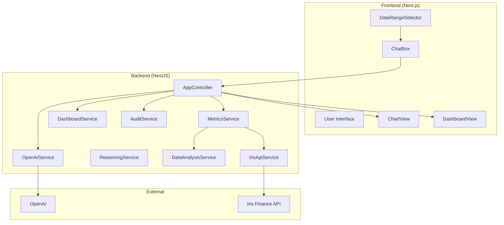

## 🎯 Iris Finance — Chat → Chart AI Platform

Transform natural language into business dashboards with live Iris data and OpenAI-assisted chart specs.

---

## 📋 Table of Contents

- **Overview**
- **Key Features**
- **Architecture**
- **Tech Stack**
- **Project Structure**
- **Quick Start**
- **Configuration**
- **How It Works (Data & Reasoning Flows)**
- **API Documentation**
- **Frontend Components**
- **Data Analysis Engine**
- **Dashboard System**
- **Reasoning System** (optional, internal)
- **Iris API Integration**
- **Audit & Compliance**
- **Testing**
- **Deployment**
- **Troubleshooting**
- **Additional Resources**

---

## 🌟 Overview

This app converts plain-English questions into visual insights. Users ask questions, the backend discovers metrics from live Iris Finance data, the AI selects suitable visualizations per metric, and the frontend renders interactive dashboards.

### Core capabilities
- **Dashboard generation**: Natural language → multi-chart dashboard
- **Live Data**: Pulls from Iris Finance API with caching and flexible date ranges
- **Metric Discovery**: Deep analysis over nested, embedded, and dynamic metrics
- **Dashboards**: Generates multiple related charts, ranked by prompt relevance
- **Deterministic selection**: Simple, explainable selection process
- **Full Audit Trail**: Request, spec, data, and metadata saved to disk

---

## ✨ Key Features

### AI and Reasoning
- **OpenAI-assisted decisions** in `OpenAiService` with explicit step-by-step chain-of-thought output captured as `aiReasoning`.
*Note: Internal reasoning utilities may exist but are not surfaced or required to run the app.*

### Visualization
- **Chart types**: `line`, `bar`, `stacked-bar`, `heatmap`, `waterfall`.
- **Tables**: Interactive `ag-grid` data table for every chart.
- **Formatting**: Automatic currency/percentage/count formatting.

### Data and Dashboards
- **Data types**: `scalar`, `timeSeries`, `groupedSeries`, `embeddedMetrics`, `dynamicKeyObject`, `array`.
- **Flexible date ranges**: Year, month, single day, ISO range, and custom range support.
- **Dashboard ranking**: Prompt-driven, quality-aware metric selection.

### Enterprise
- **Audit logs** in `server/audit-logs/` with full context.
- **Endpoints** for feedback and audit stats.

---

## 🏗️ Architecture



---

## 🛠️ Tech Stack

### Backend
- **NestJS 10**, **TypeScript 5**, **OpenAI 4**, **@nestjs/axios**, **rxjs**

### Frontend
- **Next.js 13**, **React 18**, **ag-charts-react**, **ag-grid-react**, **ag-grid-community**

### Tooling
- **ts-node**, **nodemon**, **dotenv**

---

## 📁 Project Structure

```
iris_chat_to_chart/
├─ server/
│  ├─ src/
│  │  ├─ main.ts
│  │  ├─ app.controller.ts
│  │  ├─ chat.dto.ts
│  │  ├─ openai.service.ts
│  │  ├─ reasoning.service.ts
│  │  ├─ metrics.service.ts
│  │  ├─ data-analysis.service.ts
│  │  ├─ dashboard.service.ts
│  │  ├─ audit.service.ts
│  │  └─ iris-api.service.ts
│  ├─ audit-logs/
│  ├─ package.json
│  └─ tsconfig.json
├─ web/
│  ├─ components/
│  │  ├─ ChatBox.tsx
│  │  ├─ DateRangeSelector.tsx
│  │  ├─ ChartView.tsx
│  │  ├─ DashboardView.tsx
│  │  └─ FeedbackWidget.tsx
│  ├─ pages/index.tsx
│  ├─ package.json
│  └─ tsconfig.json
├─ README.md
└─ AUDIT_README.md
```

---

## 🚀 Quick Start

### Prerequisites
- Node.js 18+
- npm 8+
- OpenAI API key
- Iris API token

### 1) Install
```bash
git clone <your-repo-url>
cd iris_chat_to_chart

cd server && npm install
cd ../web && npm install
```

### 2) Configure backend env
Create `server/.env`:
```bash
OPENAI_API_KEY=sk-...
IRIS_API_TOKEN=your_iris_api_token
# Optional overrides
IRIS_API_URL=https://api.irisfinance.co/metrics
ENABLE_REASONING=true
PORT=4000
NODE_ENV=development
```

### 3) Run
```bash
# Terminal A (backend)
cd server && npm run dev

# Terminal B (frontend)
cd web && npm run dev
```

Open `http://localhost:3000`.

---

## ⚙️ Configuration

### Backend environment
- **`OPENAI_API_KEY`**: required for OpenAI.
- **`IRIS_API_TOKEN`**: required for Iris API calls.
- **`IRIS_API_URL`**: Iris endpoint (defaults to production).
  (Reasoning flags are not required.)
- **`PORT`**, **`NODE_ENV`**: standard server config.

### Date ranges accepted
- Year: `YYYY`
- Month: `YYYY-MM`
- Day: `YYYY-MM-DD`
- Custom range: `startISO,endISO` or `YYYY-MM-DD,YYYY-MM-DD` (auto-ISO expanded)

---

## 🔄 How It Works (Data & Reasoning Flows)

### Single chart flow (`POST /chat`)
Removed. The app now supports dashboard generation only.

### Dashboard flow (`POST /dashboard`)
1. `MetricsService.getDataAnalysis()` → metric catalog.
2. `DashboardService.identifyRelatedMetrics()`
   - Selects visualizable metrics deterministically (excludes scalars) up to `maxCharts`.
3. `DashboardService.generateChartSpecs()`
   - For each metric, uses `OpenAiService` to produce a chart spec; falls back to sane defaults.
4. `MetricsService.slice()` per spec → `charts[]` array with layout metadata.
5. Optional insights synthesized by `DashboardService`.

---

## 📡 API Documentation

### POST `/chat`
Removed.

### POST `/dashboard`
Body (`DashboardDto`):
```json
{ "prompt": "Executive sales overview", "maxCharts": 5, "dateRange": "2025-06", "generateInsights": true }
```
Response: `dashboardId`, `charts[]`, `metadata`, `requestId`, `originalPrompt`.

### POST `/feedback`
Body (`FeedbackDto`): `{ requestId, rating (1..5), comment?, chartId? }` → OK.

### GET `/feedback/stats`
Aggregated feedback statistics.

### GET `/audit/stats`
Audit summary (totals, today, breakdowns, avg response time, top metrics).

### GET `/reasoning/status`
Removed.

---

## 🎨 Frontend Components
- **`pages/index.tsx`**: Orchestrates `ChatBox`, `DashboardView`.
- **`components/ChatBox.tsx`**: Dashboard-only input with date range picker, calls backend.
- **`components/DateRangeSelector.tsx`**: Outputs `YYYY`, `YYYY-MM`, `YYYY-MM-DD`, or `start,end` strings.
- **`components/ChartView.tsx`**: AG Charts config, tooltips, formatting, and `ag-grid` table.
- **`components/DashboardView.tsx`**: Renders list of charts with titles/insights and `ChartView` instances.
- **`components/FeedbackWidget.tsx`**: Sends user ratings back to `/feedback`.

---

## 🔍 Data Analysis Engine
- File: `server/src/data-analysis.service.ts`
- Discovers metrics across nested objects, arrays of objects (embedded metrics), and dynamic key objects.
- Produces:
  - `availableMetrics: MetricInfo[]`
  - `suggestedChartTypes: ChartSuggestion[]` (guided hints for the AI)
  - `dataContext: string` (compact data description for prompts)

Metric types detected:
- `scalar`, `timeSeries`, `groupedSeries`, `embeddedMetrics`, `dynamicKeyObject`, `array`

---

## 📊 Dashboard System
- File: `server/src/dashboard.service.ts`
- Selects visualizable metrics deterministically (excludes scalars), then generates specs per metric through `OpenAiService` with robust fallbacks and titles.

---

## 🧠 Reasoning System
Internal utilities may remain but are not exposed via API, nor required for normal operation.

---

## 🌐 Iris API Integration
- File: `server/src/iris-api.service.ts`
- Requires `IRIS_API_TOKEN`. Optional `IRIS_API_URL`.
- Builds filters payload, sets browser-like headers, posts via `@nestjs/axios`.
- `parseDateRange()` supports: year, month, day, ISO strings, custom ranges.
- Errors include status/data when available for easier debugging.

`MetricsService` caches responses by date range and converts raw data to a normalized chart shape via type-specific slicers:
- `sliceTimeSeries`, `sliceGroupedSeries`, `sliceNestedGroupedSeries`, `sliceScalar`, `sliceDynamicKeyObject`, `sliceEmbeddedMetrics`, `sliceArray`.

---

## 🔒 Audit & Compliance
- File: `server/src/audit.service.ts`
- Logs each request to `server/audit-logs/` with: prompt, spec, data sample, analysis summary, metadata (response time, metrics count).
- See `AUDIT_README.md` for format and operations.

Security notes:
- Logs include sensitive business data; directory is `.gitignore`d.
- Ensure proper file permissions and retention policies.

---

## 🧪 Testing
Manual checks:
```bash
# Server health
curl http://localhost:4000/audit/stats | cat

# Reasoning status
curl http://localhost:4000/reasoning/status | cat

# Single chart
curl -X POST http://localhost:4000/chat \
  -H 'Content-Type: application/json' \
  -d '{"prompt":"Show sales trends","dateRange":"2025-06"}' | cat
```

---

## 🚀 Deployment

### Backend
```bash
cd server
npm run build
NODE_ENV=production npm start
```

### Frontend
```bash
cd web
npm run build
npm start
```

Recommended env (server):
```bash
OPENAI_API_KEY=prod_openai
IRIS_API_TOKEN=prod_iris
IRIS_API_URL=https://api.irisfinance.co/metrics
ENABLE_REASONING=false
NODE_ENV=production
PORT=4000
```

---

## 🐛 Troubleshooting
- **OpenAI errors**: verify `OPENAI_API_KEY` and outbound network; test `curl https://api.openai.com/v1/models` with Bearer token.
- **Iris API errors**: verify `IRIS_API_TOKEN`; inspect server logs for response status/data.
- **Date range invalid**: follow accepted formats; custom ranges must be `startISO,endISO` or `YYYY-MM-DD,YYYY-MM-DD`.
- **Metric not found**: check available metrics in error message; try a broader keyword.

---

## 📚 Additional Resources
- OpenAI API docs, NestJS docs, Next.js docs, ag‑charts, ag‑grid (see links in prior README if needed)

---

Built with Next.js, NestJS, OpenAI, ag‑charts, and ag‑grid.